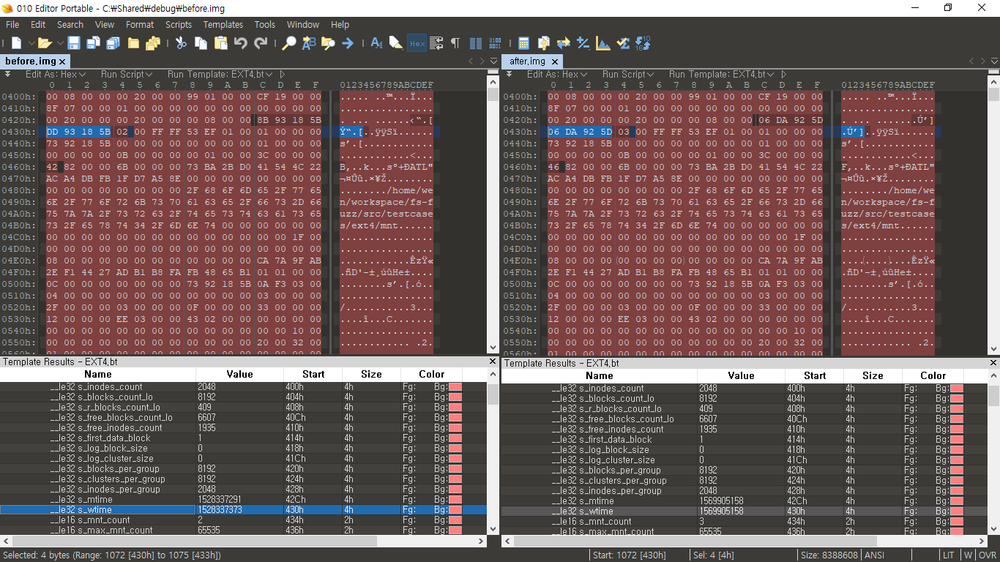
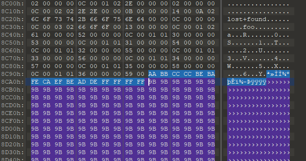

# KASan Report
```sh
root@syzkaller:~/79# ./poc ./mnt
[  349.474032] ==================================================================
[  349.474449] BUG: KASAN: use-after-free in ext4_xattr_free_space+0x200/0x300
[  349.474449] Read of size 4 at addr ffff88006ab110a4 by task poc/1964
[  349.474449]
[  349.474449] CPU: 1 PID: 1964 Comm: poc Not tainted 4.17.0 #8
[  349.474449] Hardware name: QEMU Standard PC (i440FX + PIIX, 1996), BIOS 1.10.2-1ubuntu1 04/01/2014
[  349.474449] Call Trace:
[  349.474449]  dump_stack+0xc2/0x16b
[  349.474449]  ? show_regs_print_info+0x5/0x5
[  349.474449]  ? kmsg_dump_rewind_nolock+0xd4/0xd4
[  349.474449]  ? entry_SYSCALL_64_after_hwframe+0x44/0xa9
[  349.474449]  ? apic_timer_interrupt+0xa/0x20
[  349.474449]  print_address_description+0x6e/0x280
[  349.474449]  kasan_report+0x253/0x380
[  349.474449]  ? ext4_xattr_free_space+0x200/0x300
[  349.474449]  ext4_xattr_free_space+0x200/0x300
[  349.474449]  ext4_expand_extra_isize_ea+0x1140/0x17f0
[  349.474449]  ? jbd2_journal_try_to_free_buffers+0x480/0x480
[  349.474449]  ? save_stack+0x89/0xb0
[  349.474449]  ? ext4_xattr_set+0x330/0x330
[  349.474449]  ? __ext4_get_inode_loc+0x3d0/0xeb0
[  349.474449]  ? jbd2_journal_free_transaction+0x20/0x20
[  349.474449]  ? __jbd2_journal_temp_unlink_buffer+0x4f0/0x530
[  349.474449]  ? other_inode_match+0x9c0/0x9c0
[  349.474449]  __ext4_expand_extra_isize+0x152/0x280
[  349.474449]  ext4_mark_inode_dirty+0x5ff/0x870
[  349.474449]  ? ext4_expand_extra_isize+0x4c0/0x4c0
[  349.474449]  ? ext4_generic_delete_entry+0x1ad/0x470
[  349.474449]  ? ext4_create+0x500/0x500
[  349.474449]  ? up_read+0x20/0x20
[  349.474449]  ? jbd2_journal_get_write_access+0x3d/0x80
[  349.474449]  ext4_delete_inline_entry+0x33c/0x590
[  349.474449]  ? ext4_find_inline_entry+0x400/0x400
[  349.474449]  ? ext4_expand_extra_isize+0x4c0/0x4c0
[  349.474449]  ext4_delete_entry+0x2e0/0x460
[  349.474449]  ? ext4_generic_delete_entry+0x470/0x470
[  349.474449]  ? init_once+0x10/0x10
[  349.474449]  ext4_rename+0x1fca/0x2f60
[  349.474449]  ? ext4_tmpfile+0x400/0x400
[  349.474449]  ? ext4_find_entry+0x80a/0xef0
[  349.474449]  ? __d_alloc+0x63d/0xc60
[  349.474449]  ? lockref_get+0x1b2/0x310
[  349.474449]  ? blk_mq_debugfs_unregister_sched_hctx+0x70/0x70
[  349.474449]  ? take_dentry_name_snapshot+0xbb/0x270
[  349.474449]  vfs_rename+0x9d0/0x1810
[  349.474449]  ? vfs_link+0xaa0/0xaa0
[  349.474449]  ? __d_lookup+0x700/0x700
[  349.474449]  ? ext4_cross_rename+0x2040/0x2040
[  349.474449]  do_renameat2+0x9a6/0xec0
[  349.474449]  ? user_path_create+0x30/0x30
[  349.474449]  ? cpumask_weight.constprop.2+0x35/0x35
[  349.474449]  ? _cond_resched+0x12/0x60
[  349.474449]  ? downgrade_write+0x1a0/0x1a0
[  349.474449]  ? rcu_note_context_switch+0x440/0x440
[  349.474449]  ? __do_page_fault+0x47a/0xa60
[  349.474449]  __x64_sys_rename+0x55/0x80
[  349.474449]  do_syscall_64+0x137/0x430
[  349.474449]  ? syscall_return_slowpath+0x2e0/0x2e0
[  349.474449]  ? do_page_fault+0x90/0x360
[  349.474449]  ? __do_page_fault+0xa60/0xa60
[  349.474449]  ? prepare_exit_to_usermode+0x1ae/0x200
[  349.474449]  ? perf_trace_sys_enter+0x1050/0x1050
[  349.474449]  ? __put_user_4+0x1c/0x30
[  349.474449]  entry_SYSCALL_64_after_hwframe+0x44/0xa9
[  349.474449] RIP: 0033:0x7fcd54f31d47
[  349.474449] RSP: 002b:00007fffff671c28 EFLAGS: 00000206 ORIG_RAX: 0000000000000052
[  349.474449] RAX: ffffffffffffffda RBX: 0000000000000000 RCX: 00007fcd54f31d47
[  349.474449] RDX: 00005620fba500a0 RSI: 00005620fba500a0 RDI: 00005620fba50080
[  349.474449] RBP: 00007fffff671c60 R08: 00005620fba50010 R09: 0000000000000000
[  349.474449] R10: 0000000000000642 R11: 0000000000000206 R12: 00005620fb7dd5d0
[  349.474449] R13: 00007fffff671d60 R14: 0000000000000000 R15: 0000000000000000
[  349.474449]
[  349.474449] The buggy address belongs to the page:
[  349.474449] page:ffffea0001aac440 count:0 mapcount:-127 mapping:0000000000000000 index:0x0
[  349.474449] flags: 0x100000000000000()
[  349.474449] raw: 0100000000000000 0000000000000000 0000000000000000 00000000ffffff80
[  349.474449] raw: ffffea0001b00be0 ffffea0001af37a0 0000000000000000 0000000000000000
[  349.474449] page dumped because: kasan: bad access detected
[  349.474449]
[  349.474449] Memory state around the buggy address:
[  349.474449]  ffff88006ab10f80: 00 00 00 00 00 00 00 00 00 00 00 00 00 00 00 00
[  349.474449]  ffff88006ab11000: ff ff ff ff ff ff ff ff ff ff ff ff ff ff ff ff
[  349.474449] >ffff88006ab11080: ff ff ff ff ff ff ff ff ff ff ff ff ff ff ff ff
[  349.474449]                                ^
[  349.474449]  ffff88006ab11100: ff ff ff ff ff ff ff ff ff ff ff ff ff ff ff ff
[  349.474449]  ffff88006ab11180: ff ff ff ff ff ff ff ff ff ff ff ff ff ff ff ff
[  349.474449] ==================================================================
[  349.474449] Disabling lock debugging due to kernel taint
[  349.607126] EXT4-fs error (device loop0): ext4_xattr_inode_iget:390: comm poc: error while reading EA inode 1970234923 err=-117

Message from syslogd@syzkaller at Sep 29 12:18:04 ...
 kernel:[  349.474449] page:ffffea0001aac440 count:0 mapcount:-127 mapping:0000000000000000 index:0x0

Message from syslogd@syzkaller at Sep 29 12:18:04 ...
 kernel:[  349.474449] flags: 0x100000000000000()
```

# where (gdb call stack)
KASAN calltrace는 부정확한 부분이 끼어있어 where로 cross-check 했다.
```sh
gef➤  where
#0  kasan_report (addr=0xffff8800690700a4, size=0x4, is_write=0x0, ip=0xffffffff819c48b0) at mm/kasan/report.c:398
#1  0xffffffff819c48b0 in ext4_xattr_free_space (last=0xffff8800690700a4, min_offs=<optimized out>, base=<optimized out>, total=<optimized out>) at fs/ext4/xattr.c:1332
#2  0xffffffff819d6a80 in ext4_expand_extra_isize_ea (inode=<optimized out>, new_extra_isize=<optimized out>, raw_inode=<optimized out>, handle=<optimized out>) at fs/ext4/xattr.c:2752
#3  0xffffffff818c1362 in __ext4_expand_extra_isize (inode=0xffff880067b6cec8, new_extra_isize=0x32, iloc=<optimized out>, handle=<optimized out>, no_expand=<optimized out>) at fs/ext4/inode.c:5797
#4  0xffffffff818da24f in ext4_try_to_expand_extra_isize (handle=<optimized out>, iloc=..., new_extra_isize=<optimized out>, inode=<optimized out>) at fs/ext4/inode.c:5841
#5  ext4_mark_inode_dirty (handle=0xffff880067b5c600, inode=0xffff880067b6cec8) at fs/ext4/inode.c:5917
#6  0xffffffff818bcb9c in ext4_delete_inline_entry (handle=0xffff880067b5c600, dir=0xffff880067b6cec8, de_del=<optimized out>, bh=<optimized out>, has_inline_data=0xffff880063c8042c) at fs/ext4/inline.c:1706
#7  0xffffffff81939910 in ext4_delete_entry (handle=0xffff880067b5c600, dir=0xffff880067b6cec8, de_del=<optimized out>, bh=0xffff880067b5d540) at fs/ext4/namei.c:2346
#8  0xffffffff8193e71a in ext4_rename_delete (force_reread=<optimized out>, ent=<optimized out>, handle=<optimized out>) at fs/ext4/namei.c:3393
#9  ext4_rename (old_dir=<optimized out>, old_dentry=<optimized out>, new_dir=<optimized out>, new_dentry=<optimized out>, flags=<optimized out>) at fs/ext4/namei.c:3611
#10 0xffffffff8168afb0 in vfs_rename (old_dir=<optimized out>, old_dentry=0xffff8800679a6d00, new_dir=0xffff880067b6ca28, new_dentry=0xffff8800679a6000, delegated_inode=<optimized out>, flags=<optimized out>) at fs/namei.c:4454
#11 0xffffffff81695936 in do_renameat2 (olddfd=<optimized out>, oldname=<optimized out>, newdfd=<optimized out>, newname=<optimized out>, flags=<optimized out>) at fs/namei.c:4602
#12 0xffffffff81696325 in __do_sys_rename (newname=<optimized out>, oldname=<optimized out>) at fs/namei.c:4648
#13 __se_sys_rename (newname=<optimized out>, oldname=<optimized out>) at fs/namei.c:4646
#14 __x64_sys_rename (regs=0xffff88006ba4ff58) at fs/namei.c:4646
#15 0xffffffff81008637 in do_syscall_64 (nr=<optimized out>, regs=0x4 <irq_stack_union+4>) at arch/x86/entry/common.c:287
#16 0xffffffff84000088 in entry_SYSCALL_64 () at arch/x86/entry/entry_64.S:238
#17 0x0000000000000000 in ?? ()

```

마운트 이전 파일시스템과 마운트 이후 파일시스템을 diff해보았다.


위 사진과 같이 `write time` `mount time` `mount count`가 증가했고, `Filesystem needs recovery` flag가 생겼다.
syscall 실행 후 re-mount가 안되는 이유는 `recovery-flag` 때문인듯 하다.

# Analysis

`kasan_repot` 함수에 bp를 걸고 나온 Call trace는 아래와 같다.

`r14` 레지스터에  `i` 값이 저장,
`rbp` 레지스터에는 `s` 값이 저장되어 있었다.

크래시 터지고 나서 s(`ext4_xattr_search`) 출력
```sh
gef➤  p *(struct ext4_xattr_search *)s
$23 = {
  first = 0xffff88006bd7f620,
  base = 0xffff88006bd7f600,
  end = 0xffff88006bd7fa00,
  here = 0xffff88006bd7f620,
  not_found = 0xffffffc3
}
gef➤
```

`s->first` 출력
```sh
gef➤  p (*(struct ext4_xattr_entry *)s->first)
$28 = {
  e_name_len = 0x6c,
  e_name_index = 0x6f,
  e_value_offs = 0x7473,
  e_value_inum = 0x756f662b,
  e_value_size = 0x646e,
  e_hash = 0xc,
  e_name = 0xffff88006bd7f630 "\f"
}
gef➤
```

`s->first->next` 출력
```sh
gef➤  p (*(struct ext4_xattr_entry *)(0xffff88006bd7f620 + 0x6c + 0xf))
$30 = {
  e_name_len = 0x9b,
  e_name_index = 0x9b,
  e_value_offs = 0x9b9b,
  e_value_inum = 0x9b9b9b9b,
  e_value_size = 0x9b9b9b9b,
  e_hash = 0x9b9b9b9b,
  e_name = 0xffff88006bd7f6ab '\233' <repeats 853 times>, ":\a"
}
gef➤
```

`9b9b9b9b`가 반복되는데, 해당 값은 원본 파일시스템의 `0x8C9A` 위치부터 시작된다.
`s->first`의 값이 `0x6c6f7374`(Ascii로 `lost`) 였던 부분도 `0x8C20` 위치에 보인다.

~~해당 값(`name_len`, `value_size` 등등)을 바꾸면 OOB가 가능하지 않을까?~~
곰곰히 생각해보니 패치가 `next >= s->end` 일 경우 err처리 되도록 한 것을 보면 처음부터 `UAF`가 아니라, `OOB`였던 것 같다.

테스트삼아 next의 값을 변경해보았다.


두번째 `ext4_xattr_set_entry` bp에서 아래와 같이 확인 가능했다.
```sh
gef➤  p *(struct ext4_xattr_search *)s
$3 = {
  first = 0xffff880066ffc4a0,
  base = 0xffff880066ffc480,
  end = 0xffff880066ffc880,
  here = 0xffff880066ffc4a0,
  not_found = 0xffffffc3
}
```
```sh
gef➤  p (*(struct ext4_xattr_entry *)(s->first))
$4 = {
  e_name_len = 0x6c,
  e_name_index = 0x6f,
  e_value_offs = 0x7473,
  e_value_inum = 0x756f662b,
  e_value_size = 0x646e,
  e_hash = 0xc,
  e_name = 0xffff880066ffc4b0 "\f"
}
```
```sh
gef➤  p (*(struct ext4_xattr_entry *)(0xffff880066ffc4a0 + 0x6c + 0xf))
$7 = {
  e_name_len = 0xbb,
  e_name_index = 0xcc,
  e_value_offs = 0xbecc,
  e_value_inum = 0xefcafeba,
  e_value_size = 0xffdeadbe,
  e_hash = 0x9bffffff,
  e_name = 0xffff880066ffc52b '\233' <repeats 853 times>, ";\a"
}
```

한바이트씩 밀리긴 했지만, 일단 원했던 값이 들어갔다.
OOB가 터지는지 확인을 위해 `c`를 입력했다.

```sh
[ 1846.127186] EXT4-fs (loop0): mounted filesystem with ordered data mode. Opts: (null)
[ 1846.371594] ==================================================================
[ 1846.372270] BUG: KASAN: slab-out-of-bounds in ext4_xattr_set_entry+0x32bb/0x3390
[ 1846.372270] Read of size 4 at addr ffff88006a38f5a8 by task poc/1860
[ 1846.372270]
[ 1846.372270] CPU: 0 PID: 1860 Comm: poc Not tainted 4.17.0 #8
[ 1846.372270] Hardware name: QEMU Standard PC (i440FX + PIIX, 1996), BIOS 1.10.2-1ubuntu1 04/01/2014
[ 1846.372270] Call Trace:
[ 1846.372270]  dump_stack+0xc2/0x16b
[ 1846.372270]  ? show_regs_print_info+0x5/0x5
[ 1846.372270]  ? kmsg_dump_rewind_nolock+0xd4/0xd4
[ 1846.372270]  print_address_description+0x6e/0x280
[ 1846.372270]  kasan_report+0x253/0x380
[ 1846.372270]  ? ext4_xattr_set_entry+0x32bb/0x3390
[ 1846.372270]  ext4_xattr_set_entry+0x32bb/0x3390
[ 1846.372270]  ? depot_save_stack+0x2d9/0x470
[ 1846.372270]  ? save_stack+0x89/0xb0
[ 1846.372270]  ? ext4_xattr_inode_get+0x8e0/0x8e0
[ 1846.372270]  ? __kmalloc+0x85/0x1d0
[ 1846.372270]  ? ext4_xattr_block_set+0x1bf2/0x3ab0
[ 1846.372270]  ? ext4_expand_extra_isize_ea+0xd9d/0x17f0
[ 1846.372270]  ? __ext4_expand_extra_isize+0x152/0x280
[ 1846.372270]  ? ext4_mark_inode_dirty+0x5ff/0x870
[ 1846.372270]  ? ext4_delete_inline_entry+0x33c/0x590
[ 1846.372270]  ? ext4_delete_entry+0x2e0/0x460
[ 1846.372270]  ? ext4_rename+0x1fca/0x2f60
[ 1846.372270]  ? vfs_rename+0x9d0/0x1810
[ 1846.372270]  ? __x64_sys_rename+0x55/0x80
[ 1846.372270]  ? do_syscall_64+0x137/0x430
[ 1846.372270]  ? entry_SYSCALL_64_after_hwframe+0x44/0xa9
[ 1846.372270]  ? jbd2_journal_try_to_free_buffers+0x480/0x480
[ 1846.372270]  ? __switch_to_asm+0x40/0x70
[ 1846.372270]  ? __switch_to_asm+0x34/0x70
[ 1846.372270]  ? do_get_write_access+0x7a7/0x1020
[ 1846.372270]  ? jbd2_journal_add_journal_head+0x15e/0x470
[ 1846.372270]  ? kmem_cache_alloc+0xbf/0x190
[ 1846.372270]  ? __jbd2_journal_file_buffer+0x7b0/0x7b0
[ 1846.372270]  ? jbd2_journal_add_journal_head+0x35b/0x470
[ 1846.372270]  ? rcu_note_context_switch+0x440/0x440
[ 1846.372270]  ? wake_bit_function+0x150/0x150
[ 1846.372270]  ? rcu_note_context_switch+0x440/0x440
[ 1846.372270]  ? kasan_unpoison_shadow+0x30/0x40
[ 1846.372270]  ? kasan_kmalloc+0xa0/0xd0
[ 1846.372270]  ? __kmalloc+0x85/0x1d0
[ 1846.372270]  ext4_xattr_block_set+0xd77/0x3ab0
[ 1846.372270]  ? ext4_xattr_inode_get+0x8e0/0x8e0
[ 1846.372270]  ? save_stack+0x89/0xb0
[ 1846.372270]  ? _cond_resched+0x2b/0x60
[ 1846.372270]  ? ext4_xattr_ibody_set+0x290/0x290
[ 1846.372270]  ? _cond_resched+0x12/0x60
[ 1846.372270]  ? __find_get_block+0xad0/0xad0
[ 1846.372270]  ? __read_once_size_nocheck.constprop.8+0x10/0x10
[ 1846.372270]  ? __find_get_block+0xad0/0xad0
[ 1846.372270]  ? __ext4_get_inode_loc+0x3d0/0xeb0
[ 1846.372270]  ? xattr_find_entry+0x3a/0x1e0
[ 1846.372270]  ? ext4_xattr_block_find.isra.23+0x41c/0x680
[ 1846.372270]  ext4_expand_extra_isize_ea+0xd9d/0x17f0
[ 1846.372270]  ? ext4_xattr_set+0x330/0x330
[ 1846.372270]  ? __ext4_get_inode_loc+0x3d0/0xeb0
[ 1846.372270]  ? jbd2_journal_free_transaction+0x20/0x20
[ 1846.372270]  ? __jbd2_journal_temp_unlink_buffer+0x4f0/0x530
[ 1846.372270]  ? other_inode_match+0x9c0/0x9c0
[ 1846.372270]  __ext4_expand_extra_isize+0x152/0x280
[ 1846.372270]  ext4_mark_inode_dirty+0x5ff/0x870
[ 1846.372270]  ? ext4_expand_extra_isize+0x4c0/0x4c0
[ 1846.372270]  ? ext4_generic_delete_entry+0x1ad/0x470
[ 1846.372270]  ? ext4_create+0x500/0x500
[ 1846.372270]  ? up_read+0x20/0x20
[ 1846.372270]  ? jbd2_journal_get_write_access+0x3d/0x80
[ 1846.372270]  ext4_delete_inline_entry+0x33c/0x590
[ 1846.372270]  ? ext4_find_inline_entry+0x400/0x400
[ 1846.372270]  ? ext4_expand_extra_isize+0x4c0/0x4c0
[ 1846.372270]  ext4_delete_entry+0x2e0/0x460
[ 1846.372270]  ? ext4_generic_delete_entry+0x470/0x470
[ 1846.372270]  ext4_rename+0x1fca/0x2f60
[ 1846.372270]  ? ext4_tmpfile+0x400/0x400
[ 1846.372270]  ? ext4_find_entry+0x80a/0xef0
[ 1846.372270]  ? __d_alloc+0x63d/0xc60
[ 1846.372270]  ? lockref_get+0x1b2/0x310
[ 1846.372270]  ? blk_mq_debugfs_unregister_sched_hctx+0x70/0x70
[ 1846.372270]  ? take_dentry_name_snapshot+0xbb/0x270
[ 1846.372270]  vfs_rename+0x9d0/0x1810
[ 1846.372270]  ? vfs_link+0xaa0/0xaa0
[ 1846.372270]  ? __d_lookup+0x700/0x700
[ 1846.372270]  ? ext4_cross_rename+0x2040/0x2040
[ 1846.372270]  do_renameat2+0x9a6/0xec0
[ 1846.372270]  ? user_path_create+0x30/0x30
[ 1846.372270]  ? cpumask_weight.constprop.2+0x35/0x35
[ 1846.372270]  ? _cond_resched+0x12/0x60
[ 1846.372270]  ? downgrade_write+0x1a0/0x1a0
[ 1846.372270]  ? rcu_note_context_switch+0x440/0x440
[ 1846.372270]  ? __do_page_fault+0x47a/0xa60
[ 1846.372270]  __x64_sys_rename+0x55/0x80
[ 1846.372270]  ? exit_to_usermode_loop+0x117/0x1a0
[ 1846.372270]  do_syscall_64+0x137/0x430
[ 1846.372270]  ? syscall_return_slowpath+0x2e0/0x2e0
[ 1846.372270]  ? do_page_fault+0x90/0x360
[ 1846.372270]  ? __do_page_fault+0xa60/0xa60
[ 1846.372270]  ? prepare_exit_to_usermode+0x1ae/0x200
[ 1846.372270]  ? perf_trace_sys_enter+0x1050/0x1050
[ 1846.372270]  ? __put_user_4+0x1c/0x30
[ 1846.372270]  entry_SYSCALL_64_after_hwframe+0x44/0xa9
[ 1846.372270] RIP: 0033:0x7fc4890f8d47
[ 1846.372270] RSP: 002b:00007ffef7428e18 EFLAGS: 00000206 ORIG_RAX: 0000000000000052
[ 1846.372270] RAX: ffffffffffffffda RBX: 0000000000000000 RCX: 00007fc4890f8d47
[ 1846.372270] RDX: 0000563baf2d80a0 RSI: 0000563baf2d80a0 RDI: 0000563baf2d8080
[ 1846.372270] RBP: 00007ffef7428e50 R08: 0000563baf2d8010 R09: 0000000000000000
[ 1846.372270] R10: 0000000000000642 R11: 0000000000000206 R12: 0000563baf01f5d0
[ 1846.372270] R13: 00007ffef7428f50 R14: 0000000000000000 R15: 0000000000000000
[ 1846.372270]
[ 1846.372270] Allocated by task 1860:
[ 1846.372270]  kasan_kmalloc+0xa0/0xd0
[ 1846.372270]  __kmalloc+0x85/0x1d0
[ 1846.372270]  ext4_xattr_block_set+0x1bf2/0x3ab0
[ 1846.372270]  ext4_expand_extra_isize_ea+0xd9d/0x17f0
[ 1846.372270]  __ext4_expand_extra_isize+0x152/0x280
[ 1846.372270]  ext4_mark_inode_dirty+0x5ff/0x870
[ 1846.372270]  ext4_delete_inline_entry+0x33c/0x590
[ 1846.372270]  ext4_delete_entry+0x2e0/0x460
[ 1846.372270]  ext4_rename+0x1fca/0x2f60
[ 1846.372270]  vfs_rename+0x9d0/0x1810
[ 1846.372270]  do_renameat2+0x9a6/0xec0
[ 1846.372270]  __x64_sys_rename+0x55/0x80
[ 1846.372270]  do_syscall_64+0x137/0x430
[ 1846.372270]  entry_SYSCALL_64_after_hwframe+0x44/0xa9
[ 1846.372270]
[ 1846.372270] Freed by task 1195:
[ 1846.372270]  __kasan_slab_free+0x12e/0x180
[ 1846.372270]  kfree+0x8d/0x1a0
[ 1846.372270]  skb_release_data+0x47e/0x620
[ 1846.372270]  consume_skb+0x109/0x2b0
[ 1846.372270]  skb_free_datagram+0xd/0xb0
[ 1846.372270]  unix_dgram_recvmsg+0xe9c/0x1b10
[ 1846.372270]  ___sys_recvmsg+0x27e/0x7f0
[ 1846.372270]  __sys_recvmsg+0xd7/0x210
[ 1846.372270]  do_syscall_64+0x137/0x430
[ 1846.372270]  entry_SYSCALL_64_after_hwframe+0x44/0xa9
[ 1846.372270]
[ 1846.372270] The buggy address belongs to the object at ffff88006a38f180
[ 1846.372270]  which belongs to the cache kmalloc-1024 of size 1024
[ 1846.372270] The buggy address is located 40 bytes to the right of
[ 1846.372270]  1024-byte region [ffff88006a38f180, ffff88006a38f580)
[ 1846.372270] The buggy address belongs to the page:
[ 1846.372270] page:ffffea0001a8e300 count:1 mapcount:0 mapping:0000000000000000 index:0x0 compound_mapcount: 0
[ 1846.372270] flags: 0x100000000008100(slab|head)
[ 1846.372270] raw: 0100000000008100 0000000000000000 0000000000000000 00000001800e000e
[ 1846.372270] raw: ffffea0001a47500 0000000200000002 ffff88006cc01140 0000000000000000
[ 1846.372270] page dumped because: kasan: bad access detected
[ 1846.372270]
[ 1846.372270] Memory state around the buggy address:
[ 1846.372270]  ffff88006a38f480: 00 00 00 00 00 00 00 00 00 00 00 00 00 00 00 00
[ 1846.372270]  ffff88006a38f500: 00 00 00 00 00 00 00 00 00 00 00 00 00 00 00 00
[ 1846.372270] >ffff88006a38f580: fc fc fc fc fc fc fc fc fc fc fc fc fc fc fc fc
[ 1846.372270]                                   ^
[ 1846.372270]  ffff88006a38f600: fb fb fb fb fb fb fb fb fb fb fb fb fb fb fb fb
[ 1846.372270]  ffff88006a38f680: fb fb fb fb fb fb fb fb fb fb fb fb fb fb fb fb
[ 1846.372270] ==================================================================
[ 1846.372270] Disabling lock debugging due to kernel taint
[ 1846.421956] EXT4-fs error (device loop0): ext4_xattr_inode_iget:390: comm poc: error while reading EA inode 1970234923 err=-117
```
UAF가 아닌, **slab OOB**가 일어났다!

구조를 분석해보면, `s->first`가 `lost+found`의 `l`("0x6c")를 `e_name_len`으로 가지고 있고, 반복문을 `EXT4_XATTR_NEXT` 매크로를 통해 Iterate하는데, 이 매크로가 `&entry + e_name_len + 0xf` 연산을 해주고, 우리가 `e_name_len`을 지정 가능하며, `boundary check`가 없기 때문에 OOB Access가 가능해진다.

SLAB 메모리 영역이기 때문에 이 OOB 취약점을 통해 어떤 포인터를 조작해야 가장 효과적일지 찾아봐야겠다.

## 19-10-02

where (ext4_xattr_set_entry)
```sh
[#0] 0xffffffff819c93c0 → ext4_xattr_set_entry(i=0xffff88006a377408, s=0xffff88006a3771f8, handle=0xffff880067b9d440, inode=0xffff880067bad808, is_block=0x1)
[#1] 0xffffffff819cd757 → ext4_xattr_block_set(handle=<optimized out>, inode=<optimized out>, i=0xffff88006a377408, bs=<optimized out>)
[#2] 0xffffffff819d66dd → ext4_xattr_move_to_block(entry=<optimized out>, raw_inode=<optimized out>, inode=<optimized out>, handle=<optimized out>)
[#3] 0xffffffff819d66dd → ext4_xattr_make_inode_space(total_ino=<optimized out>, bfree=<optimized out>, ifree=<optimized out>, isize_diff=<optimized out>, raw_inode=<optimized out>, inode=<optimized out>, handle=<optimized out>)
[#4] 0xffffffff819d66dd → ext4_expand_extra_isize_ea(inode=<optimized out>, new_extra_isize=<optimized out>, raw_inode=<optimized out>, handle=<optimized out>)
[#5] 0xffffffff818c1362 → __ext4_expand_extra_isize(inode=0xffff880067bad808, new_extra_isize=0x32, iloc=<optimized out>, handle=<optimized out>, no_expand=<optimized out>)
[#6] 0xffffffff818da24f → ext4_try_to_expand_extra_isize(handle=<optimized out>, iloc=<optimized out>, new_extra_isize=<optimized out>, inode=<optimized out>)
[#7] 0xffffffff818da24f → ext4_mark_inode_dirty(handle=0xffff880067b9d440, inode=0xffff880067bad808)
[#8] 0xffffffff818bcb9c → ext4_delete_inline_entry(handle=0xffff880067b9d440, dir=0xffff880067bad808, de_del=<optimized out>, bh=<optimized out>, has_inline_data=0xffff88006208542c)
[#9] 0xffffffff81939910 → ext4_delete_entry(handle=0xffff880067b9d440, dir=0xffff880067bad808, de_del=<optimized out>, bh=0xffff880067b9e1f8)
```
