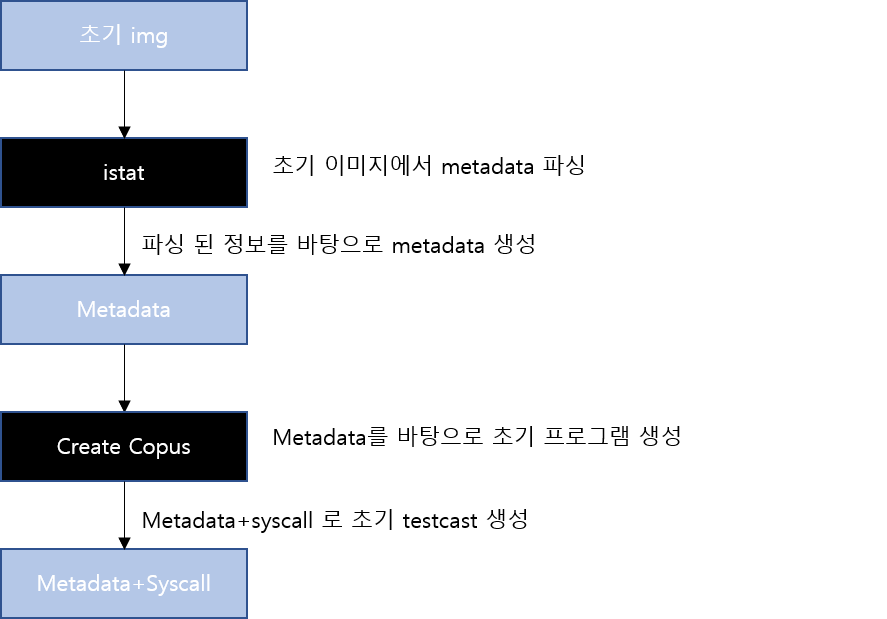
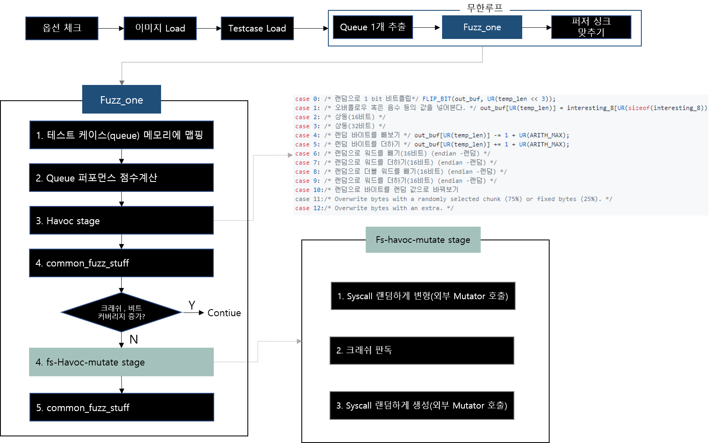

<<<<<<< HEAD
Fuzzing File Systems via Two-Dimensional Input Space Exploration
======================
# 1. 개요
Janus는 AFL 퍼저를 개량하여 만든 File System 퍼저이다.

파일시스템은 OS의 기본 구성 요소 이지만, 너무 크고 복잡하기 때문에 버그를 찾기 힘들다. 
그렇기에 대부분 스트레스 테스트 도구 및 공식 검사기에 의존한다. 하지만 파일 시스템과 OS의 복잡성이 증가함에 따라 검사를 하는데 있어서 제한적이다. 

퍼징은 가장 효과 있는 방법이지만, 파일 시스템에 적용하기에는 아래의 세 가지의 주요 문제가 발생한다.

1. 퍼징의 효율을 저하 시키는 큰 이미지 blob
=> 보통 파일 시스템의 이미지는 평균적으로 MB단위의 이미지파일이다. 
=> 전체 이미지에 대한 퍼징을 진행하기 위해서는 뮤테이션 작업과 동시에 이미지 전 영역에 흩어져 있는 checksum을 맞추어 줘야한다.
2. 이미지에 종속적인 파일 오퍼레이션
=> OS에서 파일시스템에 접근한는 방법은 VFS라는 가상 파일 시스템을 통해 각 파일 시스템으로 접근한다. 
3. 발견된 버그를 재현하기 힘들다는 점
=> 하나의 OS에서 지속적으로 퍼징을 돌리다 보면, crash가 났을때 이전 과정에 의해 crash가 발생한것인지 아닌지를 알기 힘들다.

Janus에서는 1번 문제를 해결하기 위해 큰 이미지에서 메타데이터만 추출하여 뮤테이션을 진행하며, 진행된 결과물을 원본 이미지에 합치는 과정을 통해 최소 I/O 작업으로 퍼저가 동작하도록 만들었으며, 그러기 위해 이미지 wrapper를 제작하여 해당 과정을 수행한다.
```C
static void write_to_testcase(void* mem, u32 len) {

  s32 fd = out_fd;

  if (fsfuzz_mode) {

    /* first decompress image*/
    wrapper_decompress(mem, meta_size); //mutation 결과를 이미지로 변환하는 루틴
    if (image_file)
        wrapper_sync_to_file(image_file); //Image sync 작업

    /* second flush syscalls to file */
    unlink(out_file); 
    fd = open(out_file, O_WRONLY | O_CREAT | O_EXCL, 0600);
    if (fd < 0) PFATAL("Unable to create '%s'", out_file);
    ck_write(fd, (char *)mem + meta_size, len - meta_size, out_file); 
    close(fd);
        
  } else {

      if (out_file) {

        unlink(out_file); /* Ignore errors. */

        fd = open(out_file, O_WRONLY | O_CREAT | O_EXCL, 0600);

        if (fd < 0) PFATAL("Unable to create '%s'", out_file);

      } else lseek(fd, 0, SEEK_SET);

      ck_write(fd, mem, len, out_file);

      if (!out_file) {

        if (ftruncate(fd, len)) PFATAL("ftruncate() failed");
        lseek(fd, 0, SEEK_SET);

      } else close(fd);
  }

}
```
Btrfs의 decompress 함수
보통 이미지는 메타 데이터의 손상을 감지하고 보호하기 위해 Chaecksum을 도입하고 있으며, 커널은 mount 과정에서 이를 검사하여 올바른 checksum이 아닐 경우 해당 이미지의 mount를 하지 못하도록 하여 보호 하고 있다. 그렇기 때문에 아래의 decompress과정에서 checksum을 고침으로써 해당 보호 과정을 우회(?)할 수 있다.
```C
void btrfs_fuzzer::decompress(
    const void *meta_buffer, size_t meta_len, bool checksum) {

  size_t meta_offset = 0;

  for (extent_t &extent : metadata_) {
    memcpy((char *)image_buffer_ + extent.first,
        (char *)meta_buffer + meta_offset, extent.second); //변경된 이미지 복사
    meta_offset += extent.second; //meta데이터의 offset 계산
  }

  if (checksum)
    fix_checksum(); // 변경된 이미지에 맞춰 checksum 수정

}
```
2번 문제를 해결하기 위해 Janus에서는 각 system 콜 들을 상속받아 구현함으로 이를 해결하고 있다.

3번 문제를 해결하기 위해 Janus에서는 Linux Kernel Library(LKL)을 통해 퍼징을 진행한다. 실제 mutation된 이미지를 실행하기 위해 매번 LKL을 사용하여 새로운 커널을 동작 시킴으로써 crash의 재현이 높은 확률로 가능해진다.

Janus의 동작 과정

1. istat 을 통한 seed 이미지에서의 메타 데이터 파싱
2. creat_copus를 통한 초기 시작 프로그램 생성
3. 생성된 metadata+ syscalldata 는 테스트 사례로 압축하여 퍼징


이후 janus 퍼저 동작시 위의 과정대로 진행되며, Fuzz_one의 common_fuzz_stuff 과정은 위에서 언급한 testcast를 초기 이미지와 합쳐주는 write_to_testcase 과정을 진행하고 난 후 run_target 함수를 통해 실행이 이루어 진다.

[**AFL_소스코드_분석**](https://github.com/Hikai/translation/blob/master/afl_internals/afl_internals.md)이 나름 잘되어 있는 글이 있어 링크를 남겨 둔다.

Janus는 afl 퍼저를 퍼징 엔진으로 사용하고 있기 때문에 afl의 기본 Havoc stage 중 일부를 제외한 13개의 과정을 사용하고 있다.
제외 된 과정은 
1. out_buf의 데이터를 삭제하는 과정 
2. out_buf에 out_buf 자신을 사용하여 복사 또는 insert 방법
3. extras를 사용하여 out_buf에 추가하는 방법

해당 과정을 사용하지 않은 이유는 파일시스템 특성상 meta데이터와 syscall을 사용하여 퍼징을 하는데 핵심적인 meta 데이터가 변조거되거 덮어써질 경우 전혀 실행조차 되지 않기 때문에 제외한것으로 생각된다.

제외된 데이터
```C
// out_buf의 데이터를 delete하는 방법


        case  11 ... 12 : {

            / * Delete bytes. We 're making this a bit more likely
               than insertion (the next option) in hopes of keeping
               files reasonably small. * /

            u32 del_from, del_len;

            if (temp_len < 2 ) break ;

            / * Do not delete too much. * /

            del_len = choose_block_len (temp_len - 1 ); // delete있는 길이를 지정 delete 길이는 최소 크기로 결정

            del_from = UR (temp_len - del_len + 1 ); // dekete하는 선두를 무작위로 결정

            memmove (out_buf + del_from, out_buf + del_from + del_len,
                    temp_len - del_from - del_len); // del_from에서 del_len의 더한 위치 (delete되는 가장 뒤에 다음)를 del_from 위치로 이동

            temp_len - = del_len; // delete 한 길이의 뺄셈

            break ;

          }


// out_buf에 out_buf 자신을 사용하여 복사 또는 insert 방법


        case  13 :

          if (temp_len + HAVOC_BLK_XL <MAX_FILE) { // 1KB를 초과하지 않을 때

            / * Clone bytes (75 %) or insert a block of constant bytes (25 %) * /

            u8 actually_clone = UR ( 4 );
            u32 clone_from, clone_to, clone_len;
            u8 * new_buf;

            if (actually_clone) { // 1,2,3 때

              clone_len = choose_block_len (temp_len); // clone 길이의 선정
              clone_from = UR (temp_len - clone_len + 1 ); // clone하는 첫 번째 선정

            } else { // 0 일 때 block 단위의 insert 전략에 강제로

              clone_len = choose_block_len (HAVOC_BLK_XL);
              clone_from = 0 ;

            }

            clone_to = UR (temp_len);

            new_buf = ck_alloc_nozero (temp_len + clone_len);

            / * Head * /

            memcpy (new_buf, out_buf, clone_to);

            / * Inserted part * /

            if (actually_clone)
              memcpy (new_buf + clone_to, out_buf + clone_from, clone_len); // 복사 전략
            else
              memset (new_buf + clone_to,
                     UR ( 2 )? UR ( 256 ) : out_buf [ UR (temp_len), clone_len); // insert 전략

            / * Tail * /
            memcpy (new_buf + clone_to + clone_len, out_buf + clone_to,
                   temp_len - clone_to); // 복사 또는 insert 한 다음 부분에 out_buf의 clone 다음 나머지 값을 넣는다

            ck_free (out_buf);
            out_buf = new_buf; // out_buf 포인터를 new_buf하기
            temp_len + = clone_len; // clone 한 길이 분을 가산

          }

          break ;


// extras를 사용하여 out_buf에 추가하는 방법


        case  16 : {

            u32 use_extra, extra_len, insert_at = UR (temp_len + 1 ); // out_uf 임의의 길이
            u8 * new_buf;

            / * Insert an extra. Do the same dice-rolling stuff as for the
               previous case. * /

            if (! extras_cnt || (a_extras_cnt && UR ( 2 ))) { // extras이 없을 때, 또는 자동 extras 1과 AND를 취했을 때

              use_extra = UR (a_extras_cnt);
              extra_len = a_extras [use_extra]. len ;

              if (temp_len + extra_len> = MAX_FILE) break ;

              new_buf = ck_alloc_nozero (temp_len + extra_len);

              / * Head * /
              memcpy (new_buf, out_buf, insert_at); // out_buf 처음부터 insert_at까지의 길이를 new_buf에 복사

              / * Inserted part * /
              memcpy (new_buf + insert_at, a_extras [use_extra]. data , extra_len); // 뒤에 extras를 삽입

            } else { // extras가있을 때, 또는 자동 extras가 0과 AND를 취했을 때

              use_extra = UR (extras_cnt);
              extra_len = extras [use_extra]. len ;

              if (temp_len + extra_len> = MAX_FILE) break ;

              new_buf = ck_alloc_nozero (temp_len + extra_len);

              / * Head * /
              memcpy (new_buf, out_buf, insert_at);

              / * Inserted part * /
              memcpy (new_buf + insert_at, extras [use_extra]. data , extra_len); // 뒤에 extras를 삽입

            }

            / * Tail * /
            memcpy (new_buf + insert_at + extra_len, out_buf + insert_at,
                   temp_len - insert_at); // out_buf의 나머지를 extras 뒤에 붙인다

            ck_free (out_buf);
            out_buf = new_buf;
            temp_len + = extra_len;

            break ;

          }

      }
```

작성중 .....
=======
Fuzzing File Systems via Two-Dimensional Input Space Exploration
======================
# 1. 개요
Janus는 AFL 퍼저를 개량하여 만든 File System 퍼저이다.

파일시스템은 OS의 기본 구성 요소 이지만, 너무 크고 복잡하기 때문에 버그를 찾기 힘들다. 
그렇기에 대부분 스트레스 테스트 도구 및 공식 검사기에 의존한다. 하지만 파일 시스템과 OS의 복잡성이 증가함에 따라 검사를 하는데 있어서 제한적이다. 

퍼징은 가장 효과 있는 방법이지만, 파일 시스템에 적용하기에는 아래의 세 가지의 주요 문제가 발생한다.

1. 퍼징의 효율을 저하 시키는 큰 이미지 blob
=> 보통 파일 시스템의 이미지는 평균적으로 MB단위의 이미지파일이다. 
=> 전체 이미지에 대한 퍼징을 진행하기 위해서는 뮤테이션 작업과 동시에 이미지 전 영역에 흩어져 있는 checksum을 맞추어 줘야한다.
2. 이미지에 종속적인 파일 오퍼레이션
=> OS에서 파일시스템에 접근한는 방법은 VFS라는 가상 파일 시스템을 통해 각 파일 시스템으로 접근한다. 
3. 발견된 버그를 재현하기 힘들다는 점
=> 하나의 OS에서 지속적으로 퍼징을 돌리다 보면, crash가 났을때 이전 과정에 의해 crash가 발생한것인지 아닌지를 알기 힘들다.

Janus에서는 1번 문제를 해결하기 위해 큰 이미지에서 메타데이터만 추출하여 뮤테이션을 진행하며, 진행된 결과물을 원본 이미지에 합치는 과정을 통해 최소 I/O 작업으로 퍼저가 동작하도록 만들었으며, 그러기 위해 이미지 wrapper를 제작하여 해당 과정을 수행한다.
```C
static void write_to_testcase(void* mem, u32 len) {

  s32 fd = out_fd;

  if (fsfuzz_mode) {

    /* first decompress image*/
    wrapper_decompress(mem, meta_size); //mutation 결과를 이미지로 변환하는 루틴
    if (image_file)
        wrapper_sync_to_file(image_file); //Image sync 작업

    /* second flush syscalls to file */
    unlink(out_file); 
    fd = open(out_file, O_WRONLY | O_CREAT | O_EXCL, 0600);
    if (fd < 0) PFATAL("Unable to create '%s'", out_file);
    ck_write(fd, (char *)mem + meta_size, len - meta_size, out_file); 
    close(fd);
        
  } else {

      if (out_file) {

        unlink(out_file); /* Ignore errors. */

        fd = open(out_file, O_WRONLY | O_CREAT | O_EXCL, 0600);

        if (fd < 0) PFATAL("Unable to create '%s'", out_file);

      } else lseek(fd, 0, SEEK_SET);

      ck_write(fd, mem, len, out_file);

      if (!out_file) {

        if (ftruncate(fd, len)) PFATAL("ftruncate() failed");
        lseek(fd, 0, SEEK_SET);

      } else close(fd);
  }

}
```
Btrfs의 decompress 함수
보통 이미지는 메타 데이터의 손상을 감지하고 보호하기 위해 Chaecksum을 도입하고 있으며, 커널은 mount 과정에서 이를 검사하여 올바른 checksum이 아닐 경우 해당 이미지의 mount를 하지 못하도록 하여 보호 하고 있다. 그렇기 때문에 아래의 decompress과정에서 checksum을 고침으로써 해당 보호 과정을 우회(?)할 수 있다.
```C
void btrfs_fuzzer::decompress(
    const void *meta_buffer, size_t meta_len, bool checksum) {

  size_t meta_offset = 0;

  for (extent_t &extent : metadata_) {
    memcpy((char *)image_buffer_ + extent.first,
        (char *)meta_buffer + meta_offset, extent.second); //변경된 이미지 복사
    meta_offset += extent.second; //meta데이터의 offset 계산
  }

  if (checksum)
    fix_checksum(); // 변경된 이미지에 맞춰 checksum 수정

}
```
2번 문제를 해결하기 위해 Janus에서는 각 system 콜 들을 상속받아 구현함으로 이를 해결하고 있다.

3번 문제를 해결하기 위해 Janus에서는 Linux Kernel Library(LKL)을 통해 퍼징을 진행한다. 실제 mutation된 이미지를 실행하기 위해 매번 LKL을 사용하여 새로운 커널을 동작 시킴으로써 crash의 재현이 높은 확률로 가능해진다.

Janus의 동작 과정

1. istat 을 통한 seed 이미지에서의 메타 데이터 파싱
2. creat_copus를 통한 초기 시작 프로그램 생성
3. 생성된 metadata+ syscalldata 는 테스트 사례로 압축하여 퍼징


이후 janus 퍼저 동작시 위의 과정대로 진행되며, Fuzz_one의 common_fuzz_stuff 과정은 위에서 언급한 testcast를 초기 이미지와 합쳐주는 write_to_testcase 과정을 진행하고 난 후 run_target 함수를 통해 실행이 이루어 진다.

[**AFL_소스코드_분석**](https://github.com/Hikai/translation/blob/master/afl_internals/afl_internals.md)이 나름 잘되어 있는 글이 있어 링크를 남겨 둔다.

Janus는 afl 퍼저를 퍼징 엔진으로 사용하고 있기 때문에 afl의 기본 Havoc stage 중 일부를 제외한 13개의 과정을 사용하고 있다.
제외 된 과정은 
1. out_buf의 데이터를 삭제하는 과정 
2. out_buf에 out_buf 자신을 사용하여 복사 또는 insert 방법
3. extras를 사용하여 out_buf에 추가하는 방법

해당 과정을 사용하지 않은 이유는 파일시스템 특성상 meta데이터와 syscall을 사용하여 퍼징을 하는데 핵심적인 meta 데이터가 변조거되거 덮어써질 경우 전혀 실행조차 되지 않기 때문에 제외한것으로 생각된다.

제외된 데이터
```C
// out_buf의 데이터를 delete하는 방법


        case  11 ... 12 : {

            / * Delete bytes. We 're making this a bit more likely
               than insertion (the next option) in hopes of keeping
               files reasonably small. * /

            u32 del_from, del_len;

            if (temp_len < 2 ) break ;

            / * Do not delete too much. * /

            del_len = choose_block_len (temp_len - 1 ); // delete있는 길이를 지정 delete 길이는 최소 크기로 결정

            del_from = UR (temp_len - del_len + 1 ); // dekete하는 선두를 무작위로 결정

            memmove (out_buf + del_from, out_buf + del_from + del_len,
                    temp_len - del_from - del_len); // del_from에서 del_len의 더한 위치 (delete되는 가장 뒤에 다음)를 del_from 위치로 이동

            temp_len - = del_len; // delete 한 길이의 뺄셈

            break ;

          }


// out_buf에 out_buf 자신을 사용하여 복사 또는 insert 방법


        case  13 :

          if (temp_len + HAVOC_BLK_XL <MAX_FILE) { // 1KB를 초과하지 않을 때

            / * Clone bytes (75 %) or insert a block of constant bytes (25 %) * /

            u8 actually_clone = UR ( 4 );
            u32 clone_from, clone_to, clone_len;
            u8 * new_buf;

            if (actually_clone) { // 1,2,3 때

              clone_len = choose_block_len (temp_len); // clone 길이의 선정
              clone_from = UR (temp_len - clone_len + 1 ); // clone하는 첫 번째 선정

            } else { // 0 일 때 block 단위의 insert 전략에 강제로

              clone_len = choose_block_len (HAVOC_BLK_XL);
              clone_from = 0 ;

            }

            clone_to = UR (temp_len);

            new_buf = ck_alloc_nozero (temp_len + clone_len);

            / * Head * /

            memcpy (new_buf, out_buf, clone_to);

            / * Inserted part * /

            if (actually_clone)
              memcpy (new_buf + clone_to, out_buf + clone_from, clone_len); // 복사 전략
            else
              memset (new_buf + clone_to,
                     UR ( 2 )? UR ( 256 ) : out_buf [ UR (temp_len), clone_len); // insert 전략

            / * Tail * /
            memcpy (new_buf + clone_to + clone_len, out_buf + clone_to,
                   temp_len - clone_to); // 복사 또는 insert 한 다음 부분에 out_buf의 clone 다음 나머지 값을 넣는다

            ck_free (out_buf);
            out_buf = new_buf; // out_buf 포인터를 new_buf하기
            temp_len + = clone_len; // clone 한 길이 분을 가산

          }

          break ;


// extras를 사용하여 out_buf에 추가하는 방법


        case  16 : {

            u32 use_extra, extra_len, insert_at = UR (temp_len + 1 ); // out_uf 임의의 길이
            u8 * new_buf;

            / * Insert an extra. Do the same dice-rolling stuff as for the
               previous case. * /

            if (! extras_cnt || (a_extras_cnt && UR ( 2 ))) { // extras이 없을 때, 또는 자동 extras 1과 AND를 취했을 때

              use_extra = UR (a_extras_cnt);
              extra_len = a_extras [use_extra]. len ;

              if (temp_len + extra_len> = MAX_FILE) break ;

              new_buf = ck_alloc_nozero (temp_len + extra_len);

              / * Head * /
              memcpy (new_buf, out_buf, insert_at); // out_buf 처음부터 insert_at까지의 길이를 new_buf에 복사

              / * Inserted part * /
              memcpy (new_buf + insert_at, a_extras [use_extra]. data , extra_len); // 뒤에 extras를 삽입

            } else { // extras가있을 때, 또는 자동 extras가 0과 AND를 취했을 때

              use_extra = UR (extras_cnt);
              extra_len = extras [use_extra]. len ;

              if (temp_len + extra_len> = MAX_FILE) break ;

              new_buf = ck_alloc_nozero (temp_len + extra_len);

              / * Head * /
              memcpy (new_buf, out_buf, insert_at);

              / * Inserted part * /
              memcpy (new_buf + insert_at, extras [use_extra]. data , extra_len); // 뒤에 extras를 삽입

            }

            / * Tail * /
            memcpy (new_buf + insert_at + extra_len, out_buf + insert_at,
                   temp_len - insert_at); // out_buf의 나머지를 extras 뒤에 붙인다

            ck_free (out_buf);
            out_buf = new_buf;
            temp_len + = extra_len;

            break ;

          }

      }
```

작성중 .....
>>>>>>> 8d9386b9ab47600549c5915d3d9cbbaa66a01e43
