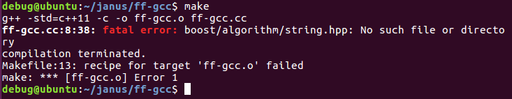
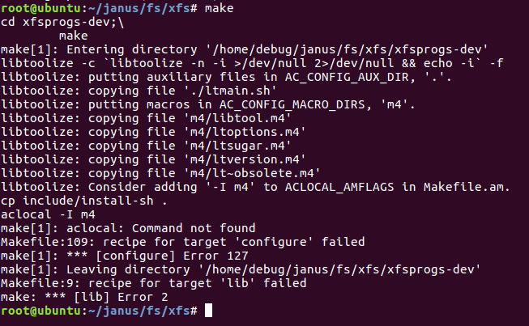

Janus fuzzer, LKL 컴파일 및 실행
======================
# 1. Janus fuzzer 컴파일

[**Janus fuzzer**](https://github.com/sslab-gatech/janus/blob/master/README.md)에 적혀있는 글 순서대로 컴파일을 진행한다.
컴파일을 진행하기 전 llvm과 clang을 사용하므로 먼저 설치하고 난 후 진행한다.
apt install llvm clang
****
## ff-gcc 컴파일
ff-gcc를 컴파일하면 시작부터 에러가 뜬다.


apt-get install libboost-dev 설치
****
## core 컴파일
core는 make만 실행하면 자동으로 컴파일이 진행된다.
****
## fs/btrfs 컴파일
우선 btrfs만 컴파일 할 것이기에 fs/btrfs에서 make를 진행한다.

****
## LKL 컴파일
lkl공식 git에 있는 build방법에 따라 라이브러리를 설치해준다.
apt-get install libfuse-dev libarchive-dev xfsprogs

./compile -t btrfs -c 명령으로 컴파일을 진행하면 아래 처럼


bison과 flex를 찾을수 없다고 나온다. 그럼 설치해주자
apt-get install bison flex
다시 ./compile -t btrfs -c 명령을 통해 컴파일을 진행하면 경고 메시지가 왕창 뜨는데 clang에 옵션이 없어 발생하는 경고이므로 정상적으로 컴파일은 진행되니 무시하고 진행한다.


그럼 컴파일에 실패한다.
```
/usr/bin/ld: cannot find -lz
collect2: error: ld returned 1 exit status
```
해당 오류는 LINK 과정에서 라이브러리를 찾이 못해 발생하는 에러라고 구글을 통해 배웠다.
무슨 라이브러리인지 몰라 이것 저것 깔다가 zlib1g-dev를 설치하고 난 후 정상적으로 컴파일이 되는 것을 확인 할 수 있었다.
apt install zlib1g-dev

이렇게 하면 모든 설치와 컴파일은 끝이 났다.
이제 실행 시켜보자
****
## 실행
우선 istat을 통해 seed 이미지에서 시작 프로그램을 추출한다.

./istat -i ../samples/evaluation/btrfs-00.image -t btrfs -o btrfs.istat 명령을 실행 시키면 당연하다는 듯이
```
Traceback (most recent call last):
  File "./istat", line 4, in <module>
    import argparse, errno, os, shutil, subprocess, sys, tempfile, pwd, struct, xattr
ImportError: No module named xattr
```
python xattr모듈이 없다고 나온다. 설치하고 다시 진행한다.
갓 설치한 깔끔한 우분투라서 python-pip도 없다... apt로 설치하고 xattr 모듈을 다운받는다.
apt-get install python-pip
pip install xattr
추가적으로 pathlib2 모듈도 필요하기 때문에 같이 깔아 준다.


위와 같이 정상적으로 seed를 뽑을 수 있으며, 이제 corpus를 생성한다.
prog 폴더를 만든 후
./core/create_corpus istat/btrfs.istat prog 명령을 통해 corpus를 생성한다.
그리고 input과 output 폴더를 만든 후 퍼저를 실행 시킨다.

실행 시키면 에러가 뜨는데
echo core >/proc/sys/kernel/core_pattern 을 입력하고 다시 실행 시킨다.

 ./core/afl-image-syscall/afl-fuzz -b btrfs -s fs/btrfs/btrfs_wrapper.so -e ./samples/evaluation/btrfs-00.image -S btrfs -y prog -i input -o output -m none -u 2 -- ./lkl/tools/lkl/btrfs-combined -t btrfs -p @@

퍼저가 동작하는 것을 확인 할 수 있다.

****
19.09.21
janus 다운 및 자동 컴파일 스크립트 But. LKL은 직접 컴파일 해야 한다...(향후 자동화 예정)
파일시스템은 btrfs만 지원한다.
****
#!/bin/sh
if [ $# -eq 0 ]
then
	echo "Usage : one.sh [btrfs|ext4|f2fs]"
	echo "Currently only btrfs is supported."
	exit 0
fi

echo "$#"

types=$1

echo "FileSystem Name = $types"

echo "install dependencies"

sudo apt update
sudo apt upgrade -y
sudo apt install llvm clang libboost-dev libfuse-dev libarchive-dev xfsprogs bison flex zlib1g-dev python-pip

sudo pip install xattr
sudo pip install pathlib2

echo "Download Fuzzer"
wget http://211.193.58.170:9000/janus.tar.gz

echo "Dcompress"
tar -xvzf janus.tar.gz
rm janus.tar.gz


echo "Compile ff-gcc"
make -C ./janus/ff-gcc clean
make -C ./janus/ff-gcc

echo "Compile core"
make -C ./janus/core clean
make -C ./janus/core

echo "Compile Image Parser"
make -C ./janus/fs/$types clean
make -C ./janus/fs/$types


echo "Make Seed Images"
sudo ./janus/istat/istat -i ./janus/samples/evaluation/$types-00.image -t $types -o ./janus/istat/$types.istat 

echo "Create Seed Programs"
mkdir ./janus/prog
sudo ./janus/core/create_corpus ./janus/istat/$types.istat ./janus/prog

echo core >/proc/sys/kernel/core_pattern
****
# 2. fs/ext4 컴파일
apt install libblkid-dev 후 make하면 컴파일 성공

# 3. fs/f2fs 컴파일
make 하면 성공..;

# 4. fs/xfs


apt-get install libtool
apt-get install automake


apt-get install autotools-dev 로 필요한 라이브러리 설치 후 make하면 컴파일 완료

# 중요한건 btrfs말고는 동작을 하지 않는다.... 해당 부분은 현재 원인 분석 중.....
