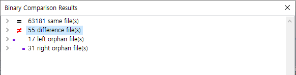
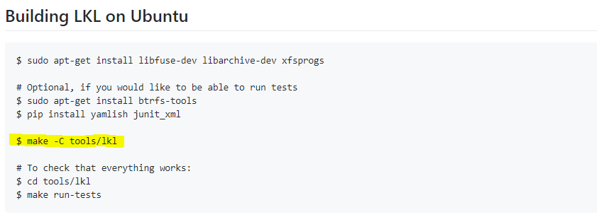

Linux Kernel Library(LKL) upgrade 5.0
======================

# 1. LKL upgrade 5.0

기존의 janus에서 사용되는 LKL 4.18 - rc1을 바탕으로 최신 버전으로 올리려고 남기는 로그

기존의 janus에 적용된 LKL 4.18 - rc1 버전은 janus 퍼저에 맞춰 커스텀된 LKL이므로 최신 버전의 LKL을 다운받아 적용 시켜도 컴파일이 정상적으로 진행되지 않는다.
쫌 더 쉬운 방법을 찾기 위해 순정 LKL 4.18 - rc1 버전을 찾아보았으나, FAIL...
[**고통 받는 그**](https://github.com/nonetype/nonetype.github.io/blob/master/_drafts/2019-09-05-JANUS%20Porting.md)와 동일한 방법으로 LKL을 upgrade 하던 중
janus를 만든 sslab에서 hydra Repositories가 존재하는 것을 확인 하였고, [**5.0버전의 LKL**](https://github.com/sslab-gatech/lkl-hydra)을 확인하였다.

janus에 적용된 LKL과 일부 동일한 부분이 변경되었음을 확인하고 순정 LKL5.0 버전을 찾아 diff를 떠본 결과 아래와 55개의 파일에 대한 변경 사항이 존재함을 알 수 있다.


diff된 결과를 바탕으로 어느 부분이 추가되고 변경되었는지를 확인하였다.

# 2. diff
전체 변경된 파일은 55개의 파일이 변경되었으며, 원본 LKL 5.0에만 존재하는 파일은 17개, 커스텀된 LKL에 존재하는 파일은 31개 이다.

## 2.1. 변경된 파일
### 2.1.1 config 파일
****
#### [**File : lkl\arch\lkl\Kconfig**](./config_file/1.md)
LKL의 kernel 설정 파일
****
#### [**File : lkl\block\Kconfig.iosched**](./config_file/2.md)
****
#### [**File : lkl\crypto\Kconfig**](./config_file/3.md)
****
#### [**File : lkl\drivers\crypto\virtio\Kconfig**](./config_file/4.md)
****
#### [**File : lkl\drivers\hid\Kconfig**](./config_file/5.md)
****
#### [**File : lkl\drivers\input\serio\Kconfig**](./config_file/6.md)
****
#### [**File : lkl\drivers\input\Kconfig**](./config_file/7.md)
****
#### [**File : lkl\drivers\ssb\Kconfig**](./config_file/8.md)
****
#### [**File : lkl\drivers\tty\Kconfig**](./config_file/9.md)
****
#### [**File : lkl\drivers\usb\Kconfig**](./config_file/10.md)
****
#### [**File : lkl\fs\proc\Kconfig**](./config_file/11.md)
****
#### [**File : lkl\drivers\usb\Kconfig**](./config_file/12.md)
****
#### [**File : lkl\fs\Kconfig.binfmt**](./config_file/13.md)
****
#### [**File : lkl\init\Kconfig**](./config_file/14.md)
****
#### [**File : lkl\kernel\dma\Kconfig**](./config_file/15.md)
****
#### [**File : lkl\lib\Kconfig**](./config_file/16.md)
****
#### [**File : lkl\lib\Kconfig.debug**](./config_file/17.md)
****

### 2.1.2 source 파일

#### [**File : lkl\arch\lkl\mm\bootmem.c**](./source/1.md)
****
#### [**File : lkl\arch\lkl\scripts\headers_install.py**](./source/2.md)
****
#### [**File : lkl\fs\namei.c**](./source/3.md)
****
#### [**File : lkl\fs\attr.c**](./source/4.md)
****
#### [**File : lkl\include\linux\dcache.h**](./source/5.md)
****
#### [**File : lkl\include\linux\fs.h**](./source/6.md)
****
#### [**File : lkl\include\uapi\linux\virtio_ring.h**](./source/7.md)
****
#### [**File : lkl\lib\raid6\algos.c**](./source/8.md)
****
#### [**File : lkl\scripts\kallsyms.c**](./source/9.md)
****
#### [**File : lkl\tools\lkl\include\lkl.h**](./source/10.md)
****
#### [**File : lkl\tools\lkl\lib\config.c**](./source/11.md)
****
#### [**File : lkl\tools\lkl\lib\net.c**](./source/12.md)
****
#### [**File : lkl\tools\lkl\lib\posix-host.c**](./source/13.md)
****
#### [**File : lkl\tools\lkl\lib\virtio_blk.c**](./source/14.md)
****
#### [**File : lkl\tools\lkl\lib\hijack\hijack.c**](./source/15.md)
****
#### [**File : lkl\tools\lkl\lib\hijack\init.c**](./source/16.md)
****
#### [**File : lkl\include\linux\mount.h**](./source/17.md)
****


### 2.1.3 build 파일
#### [**File : lkl\arch\lkl\Makefile**](./Makefile/1.md)
****
#### [**File : lkl\fs\btrfs\Makefile**](./Makefile/2.md)
****
#### [**File : lkl\fs\ext4\Makefile**](./Makefile/3.md)
****
#### [**File : lkl\fs\f2fs\Makefile**](./Makefile/4.md)
****
#### [**File : lkl\fs\xfs\Makefile**](./Makefile/5.md)
****
#### [**File : lkl\tools\lkl\lib\Build**](./Makefile/6.md)
****
#### [**File : lkl\tools\lkl\Makefile**](./Makefile/7.md)
****
#### [**File : lkl\tools\lkl\Makefile.autoconf**](./Makefile/8.md)
****
#### [**File : lkl\tools\lkl\Targets**](./Makefile/9.md)
****

# 3. LKL 5.0 upgrade

기존의 LKL에 비해 많은 부분이 바뀐거 같지만 소스 수준에서 바뀐 부분은 크지않아 보인다. 
많이 변경된 부분은 lkl\tools\lkl\lib\hijack\init.c과 lkl\tools\lkl\lib\config.c 등 주로 lkl\tools\lkl 내부의 파일들이 많이 변경된것을 알 수 있고,

사진에서 보듯이 실제 lkl을 빌드하는 부분도 tools\lkl이다.

이미 lkl-hydra가 있고, janus를 기반으로하여 업그레이드 시킨것이기 때문에 Makefile만 변경함으로 lkl5.0 버전으로 업그레이드가 가능하다.

lkl-hydra는 자체적으로 llvm을 컴파일하여 사용하고 있기 때문에 이에 맞추어 컴파일 경로가 지정되어 있다.
현재 janus의 버전에 맞추기 위해 아래와 같이 변경한다.

```C
4번 라인 include ../../../Makefile.inc
```
외부에서 Make설정을 받아오는데 해당 라인을 삭제한다.
```C
48번 라인    export CXXFLAGS += -std=c++11 -fPIC -I$(OUTPUT)/include -Iinclude -I$(SYSCALL_DIR) \  아래처럼 변경
            export CXXFLAGS += -std=c++11 -fPIC -I$(OUTPUT)/include -Iinclude -I$(OUTPUT)../../../core \
```
Makefile.inc에 지정된 SYSCALL_DIR을 janus에 맞춰 변경
```C
80~86번 라인    
$(OUTPUT)kafl-llvm-rt.o: $(AFL_LLVM_DIR)/kafl-llvm-rt.o.c
    (cd $(AFL_LLVM_DIR) && env -u CPP -u CC -u MAKEFLAGS -u LDFLAGS LLVM_CONFIG=$(LLVM_CONF) make)
    cp -f $(AFL_DIR)/kafl-llvm-rt.o $@

$(OUTPUT)kcov-llvm-rt.o: $(AFL_LLVM_DIR)/kcov-llvm-rt.o.cc
    (cd $(AFL_LLVM_DIR) && env -u CPP -u CC -u MAKEFLAGS -u LDFLAGS LLVM_CONFIG=$(LLVM_CONF) make)
    cp -f $(AFL_DIR)/kcov-llvm-rt.o $@
```

```C
  $(OUTPUT)kafl-llvm-rt.o: ../../../core/afl-image/llvm_mode/kafl-llvm-rt.o.c
    (cd ../../../core/afl-image/llvm_mode && env -u CPP -u CC -u MAKEFLAGS -u LDFLAGS LLVM_CONFIG=llvm-config make)
    cp -f ../../../core/afl-image/kafl-llvm-rt.o $@

$(OUTPUT)kcov-llvm-rt.o: ../../../core/afl-image/llvm_mode/kcov-llvm-rt.o.cc
    (cd ../../../core/afl-image/llvm_mode && env -u CPP -u CC -u MAKEFLAGS -u LDFLAGS LLVM_CONFIG=llvm-config make)
    cp -f ../../../core/afl-image/kcov-llvm-rt.o $@
```
Makefile.inc에 지정된 AFL_LLVM_DIR과 LLVM_CONF을 janus에 맞춰 변경 그 이외의 경로를 맞춰준다.
```C
97~106번 라인    
    cp -f $(SYSCALL_DIR)/Image.o $@

$(OUTPUT)Program.o:
    cp -f $(SYSCALL_DIR)/Program.o $@

$(OUTPUT)Utils.o:
    cp -f $(SYSCALL_DIR)/Utils.o $@

$(OUTPUT)Constants.o:
    cp -f $(SYSCALL_DIR)/Constants.o $@
```
컴파일을 위한 dependencies 경로 역시 맞춰준다.
```C
$(OUTPUT)Image.o:
    cp -f ../../../core/Image.o $@
    
$(OUTPUT)Program.o:
    cp -f ../../../core/Program.o $@

$(OUTPUT)Utils.o:
    cp -f ../../../core/Utils.o $@

$(OUTPUT)Constants.o:
    cp -f ../../../core/Constants.o $@
```

lkl-hydra에는 새로운 실행 파일이 추가 되어 있다. combined-consistency라는건데 아직 사용 여부를 결정하지 못했기에 제거해준다.
```C
116~118번 라인 제거
# combined-consistency (CPP)
$(OUTPUT)combined-consistency: $(OUTPUT)combined-consistency-in.o $(OUTPUT)Image.o $(OUTPUT)Program.o $(OUTPUT)Utils.o $(OUTPUT)Constants.o $(OUTPUT)liblkl.a
    $(QUIET_LINK)$(CXX) $(LDFLAGS) $(LDFLAGS_$*-y) -o $@ $^ $(LDLIBS) $(LDLIBS_$*-y)
```

이후 Target 파일을 수정함으로 써 lkl버전을 올릴 수 있다.
```C
libs-y += lib/liblkl

ifneq ($(LKL_HOST_CONFIG_BSD),y)
libs-$(LKL_HOST_CONFIG_POSIX) += lib/hijack/liblkl-hijack
endif
LDFLAGS_lib/hijack/liblkl-hijack-y += -shared -nodefaultlibs
LDLIBS_lib/hijack/liblkl-hijack-y += -ldl
LDLIBS_lib/hijack/liblkl-hijack-$(LKL_HOST_CONFIG_ANDROID) += -lgcc -lc

progs-$(LKL_HOST_CONFIG_FUSE) += lklfuse
LDLIBS_lklfuse-y := -lfuse

progs-$(LKL_HOST_CONFIG_ARCHIVE) += fs2tar
LDLIBS_fs2tar-y := -larchive
LDLIBS_fs2tar-$(LKL_HOST_CONFIG_NEEDS_LARGP) += -largp

progs-y += fsfuzz
LDLIBS_fsfuzz-y := -larchive
LDLIBS_fsfuzz-$(LKL_HOST_CONFIG_NEEDS_LARGP) += -largp

progs-y += executor
LDLIBS_executor-y := -larchive
LDLIBS_executor-$(LKL_HOST_CONFIG_NEEDS_LARGP) += -largp

progs-y += combined
LDLIBS_combined-y := -larchive
LDLIBS_combined-$(LKL_HOST_CONFIG_NEEDS_LARGP) += -largp

progs-$(LKL_HOST_CONFIG_ARCHIVE) += cptofs
LDLIBS_cptofs-y := -larchive
LDLIBS_cptofs-$(LKL_HOST_CONFIG_NEEDS_LARGP) += -largp

progs-y += tests/boot
progs-y += tests/disk
# progs-y += tests/net-test
```


이렇게 간단하게 lkl의 버전을 5.0까지 높일 수 있다. 

이를 바탕으로 최신버전으로 올리려고 하였으나, timer 부분에서 문제가 생겨 해당 부분은 현재 보류중이다....
