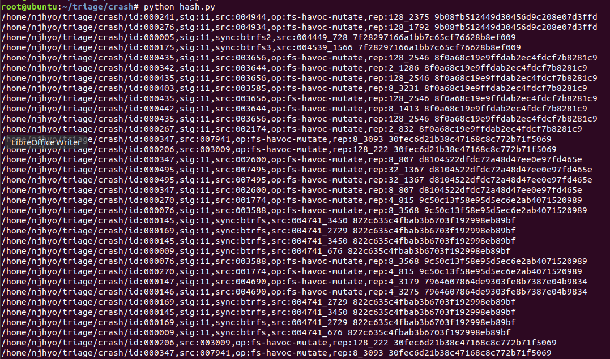
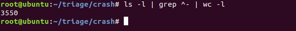

Triage? 만들기?
======================
# 1. 삽질의 시작



서버에서 LKL 5.0 기준으로 퍼징을 돌린 btrfs 파일 시스템의 crash파일을 모두 모아 혹시 모를 중복을 제거하기 위해 hash값을 기반으로 중복검사를 하니 병렬로 퍼징을 돌려서 그런지 생각보다 중복이 쫌 있어, 중복되는 파일을 제거하고 난 이후의 crash 개수는 



3550개 무려 3550개...

수작업으로 분류하기에는 힘들거 같고, dmesg나 KASAN Report내역을 보고 분석을 진행하니... 실제 환경에서 dmesg나 KASAN Report를 뽑는게 좋을거 같은데...
어째든 자동화를 시켜보고자 한다.

사용할 방법은 LKL과 QEMU, VM이 후보 순위다. 다만 LKL의 경우 자세한 내역이 출력되지 않고, KASAN을 어떻게 붙여야 할지 의문이다... JANUS논문을 확인했을때는 LKL에 KASAN을 붙이기 위해 소스를 수정하면 된다는데... [**LKL issues**](https://github.com/lkl/linux/issues/463) LKL 제작에 참여한 사람도 시도해본적 없다고하고... 실제로 KASAN을 붙이기 위해 LKL 빌드전 config 파일을 바꿔봐도 어떻게 설정했는지 의문이다. <= 이부분은 쫌더 확인을 해봐야겠다.

따라서 LKL과, VM을 통한 작업 진행보다는 QEMU를 통해서 자동화 시켜볼 생각이다. 

현재 생각은 crash 파일을 바탕으로 img와 poc를 생성 시키고, QEMU에 실행 전 rootfs에 넣은 뒤 QEMU를 실행 시켜 부팅 시킨 뒤 tmp.img와 poc를 실행 시킨 후 나온 dmesg와 KASN Report를 수집하면 될거 같다.

QEMU를 통해 실행 시킬 경우 QEMU 가상 머신과 I/O작업을 진행해야하는데... 기본은 stdio이다. 
즉 터미널을 통해서 출력하고, 입력을 받는데 지금 필요한 작업은 터미널이 아닌, Background 작업이 필요하다. 
이래 저래 찾다기 [**Input/output through a named pipe (file)**](https://fadeevab.com/how-to-setup-qemu-output-to-console-and-automate-using-shell-script/)이라는 기능을 찾았고, 실제 동작 시켜보니 제대로 돌아가는것을 확인했으며, 터미널에서 출력되는 내용을 파일라 주고 받고 명령도 실행 시킬 수 있는 방법을 찾았다.

Crash 파일을 img와 poc로 변경하는 건 janus에서 만들어둔 afl-parse를 사용하여 제작하면 되는것이고...

KASAN을 붙인 커널의 경우 부팅 속도가 상당히 느리다... 약 300초 정도..??
부팅에 300초 잡고, 실행하고 결과보는데까지 넉넉잡아 50초 정도 잡으면... 350초 
'''
3550*350 = 1,242,500‬
1,242,500‬ / 3600 = 345
345/24 = 14일 하고 9시간....
'''
한번 돌면 14일을 꼬박 돌려야 3550개를 처리할 수 있다. 
시간 줄이는건 차후에 생각해보고...

crash 분류에 앞서 한 100개 넘개 직접 VM에 마운트를 시켜봤는데....

mount 파트

```
1. mount 시 터짐
2. mount 성공
3. mount 시 error
4. 여러번 mount 시도 시 터짐
5. 여러번 mount 시도 시 마운트 성공
```

poc 파트

```
6. poc 실행 시 터짐
7. poc 여러번 실행 시 터짐
8. poc 오류
9. poc 실행 후 이상 무
```

umount 파트

```
10. umount시 터짐
11. umount시 이상 무
12. Etc....
```

약 11개 정도로 나눌수 있을거 같다. 사실 더 많은 케이스가 존재한다... 이것도 대표적으로만 뽑은거라....
예를 들어 mount성공했는데 약간의 시간이 지난 후 터진다던가.... 
mount 성공하고 poc돌렸는데 역시 약간의 시간이 지나고 터진다거나.... 등등... 여러가지 알 수 없는 케이스가 더 존재한다.

다음 고민은 Panic이 난것과 나지 않은것(생존한것), 에러가 터진것 등을 어떻게 구분할 것인가 라는 문제가 존재한다.
panic의 경우는 확실히 구분이 가능하다.
Kernel panic 이라는 문자열만 검사하면 확인이 가능한데, panic이 안난것의 경우 어떻게 구분할 건지 문제 사항이 있다. 
예를 들어 마운트는 성공했는데 난데없이 KASAN Report가 뜨고 아무 이상이 없다던지...
error의 구분은 어떻게 할것인가 등... 아직 생각할건 많은거 같다...

프로세스를 죽일때는 간단히 아래와 같이 process를 죽여버리면 될 일이고.. 우선은 case by case로 나눠서 생각해봐야겠다.

killall -9 qemu-system-x86_64 


마운트 오류 시
mount: wrong

마운트 성공 시
[   81.215109] BTRFS info (device loop0): disk space caching is enabled
[   81.215414] BTRFS info (device loop0): has skinny extents

로그인시 문자열 
syzkaller login: 
로그인 후 문자열
root@syzkaller:~# 

dmesg 예시 

[   91.964000] WARNING: CPU: 1 PID: 1995 at fs/btrfs/tree-log.c:2759 walk_up_log_tree+0x1e6/0x230
[   91.964000] Modules linked in:
[   91.964000] CPU: 1 PID: 1995 Comm: tmp Not tainted 5.0.0 #12
[   91.964000] Hardware name: QEMU Standard PC (i440FX + PIIX, 1996), BIOS 1.10.2-1ubuntu1 04/01/2014
[   91.964000] RIP: 0010:walk_up_log_tree+0x1e6/0x230
[   91.964000] Code: 48 63 45 00 48 83 7c 24 20 00 4d 8b 24 c7 0f 85 be fe ff ff f0 49 0f ba 74 24 10 01 72 1b 48 83 7c 24 10 fa 0f 84 e6 fe ff ff <0f> 0b e9 df fe ff ff 48 89 f2 e9 71 ff ff ff 4c 89 e7 e8 63 5e fe
[   91.964000] RSP: 0018:ffffc90000c63ce8 EFLAGS: 00000217
[   91.964000] RAX: ffff888079d10d90 RBX: 0000000000000000 RCX: 000000000003ffff
[   91.964000] RDX: ffff888079d10d90 RSI: 0000000000001c25 RDI: ffff888079d10d20
[   91.964000] RBP: ffffc90000c63d54 R08: ffff888079d10d88 R09: 0000000000040000
[   91.964000] R10: 0000000000001c26 R11: ffffffffffffffff R12: ffff888079d10d20
[   91.964000] R13: ffff888000000000 R14: ffffc90000c63da0 R15: ffff8880790ff070
[   91.964000] FS:  00007fdb05add440(0000) GS:ffff88807db00000(0000) knlGS:0000000000000000
[   91.964000] CS:  0010 DS: 0000 ES: 0000 CR0: 0000000080050033
[   91.964000] CR2: 00007ffd532ded90 CR3: 0000000079f46000 CR4: 00000000000006e0
[   91.964000] Call Trace:
[   91.964000]  walk_log_tree+0xaf/0x1e0
[   91.964000]  free_log_tree+0x47/0x110
[   91.964000]  ? radix_tree_gang_lookup_tag+0xa6/0x110
[   91.964000]  ? wait_for_writer+0xc0/0xc0
[   91.964000]  btrfs_free_log+0x15/0x30
[   91.964000]  commit_fs_roots+0x98/0x180
[   91.964000]  ? btrfs_run_delayed_refs+0x74/0x180
[   91.964000]  btrfs_commit_transaction+0x315/0x920
[   91.964000]  ? btrfs_attach_transaction_barrier+0x19/0x40
[   91.964000]  sync_filesystem+0x6b/0x90
[   91.964000]  __x64_sys_syncfs+0x37/0x70
[   91.964000]  do_syscall_64+0x43/0xf0
[   91.964000]  entry_SYSCALL_64_after_hwframe+0x44/0xa9
[   91.964000] RIP: 0033:0x7fdb05604469
[   91.964000] Code: 00 f3 c3 66 2e 0f 1f 84 00 00 00 00 00 0f 1f 40 00 48 89 f8 48 89 f7 48 89 d6 48 89 ca 4d 89 c2 4d 89 c8 4c 8b 4c 24 08 0f 05 <48> 3d 01 f0 ff ff 73 01 c3 48 8b 0d ff 49 2b 00 f7 d8 64 89 01 48
[   91.964000] RSP: 002b:00007ffd532dbbe8 EFLAGS: 00000217 ORIG_RAX: 0000000000000132
[   91.964000] RAX: ffffffffffffffda RBX: 0000000000000000 RCX: 00007fdb05604469
[   91.964000] RDX: 00007fdb05604469 RSI: 00007fdb05604469 RDI: 0000000000000004
[   91.964000] RBP: 00007ffd532dfda0 R08: 00007ffd532dfe88 R09: 00007ffd532dfe88
[   91.964000] R10: 00007ffd532dfe88 R11: 0000000000000217 R12: 000055eba31705f0
[   91.964000] R13: 00007ffd532dfe80 R14: 0000000000000000 R15: 0000000000000000
[   91.964000] ---[ end trace ef6eb5bfb633ed0e ]---

[   91.977587] WARNING: CPU: 0 PID: 1995 at fs/btrfs/tree-log.c:2759 walk_up_log_tree+0x1e6/0x230
[   91.977587] Modules linked in:
[   91.977587] CPU: 0 PID: 1995 Comm: tmp Tainted: G        W         5.0.0 #12
[   91.977587] Hardware name: QEMU Standard PC (i440FX + PIIX, 1996), BIOS 1.10.2-1ubuntu1 04/01/2014
[   91.977587] RIP: 0010:walk_up_log_tree+0x1e6/0x230
[   91.977587] Code: 48 63 45 00 48 83 7c 24 20 00 4d 8b 24 c7 0f 85 be fe ff ff f0 49 0f ba 74 24 10 01 72 1b 48 83 7c 24 10 fa 0f 84 e6 fe ff ff <0f> 0b e9 df fe ff ff 48 89 f2 e9 71 ff ff ff 4c 89 e7 e8 63 5e fe
[   91.977587] RSP: 0018:ffffc90000c63d78 EFLAGS: 00000217
[   91.977587] RAX: ffff8880790cac78 RBX: 0000000000000000 RCX: 000000000003ffff
[   91.977587] RDX: ffff8880790cac78 RSI: 0000000000001c24 RDI: ffff8880790cac08
[   91.977587] RBP: ffffc90000c63de4 R08: ffff8880790cac70 R09: 0000000000040000
[   91.977587] R10: 0000000000001c25 R11: ffffffffffffffff R12: ffff8880790cac08
[   91.977587] R13: ffff888000000000 R14: ffffc90000c63e30 R15: ffff88807909f000
[   91.977587] FS:  00007fdb05add440(0000) GS:ffff88807da00000(0000) knlGS:0000000000000000
[   91.977587] CS:  0010 DS: 0000 ES: 0000 CR0: 0000000080050033
[   91.977587] CR2: 0000000000b04b08 CR3: 0000000079f46000 CR4: 00000000000006f0
[   91.977587] Call Trace:
[   91.977587]  walk_log_tree+0xaf/0x1e0
[   91.977587]  free_log_tree+0x47/0x110
[   91.977587]  ? wait_for_writer+0xc0/0xc0
[   91.977587]  btrfs_free_log_root_tree+0x15/0x30
[   91.977587]  btrfs_commit_transaction+0x330/0x920
[   91.977587]  ? btrfs_attach_transaction_barrier+0x19/0x40
[   91.977587]  sync_filesystem+0x6b/0x90
[   91.977587]  __x64_sys_syncfs+0x37/0x70
[   91.977587]  do_syscall_64+0x43/0xf0
[   91.977587]  entry_SYSCALL_64_after_hwframe+0x44/0xa9
[   91.977587] RIP: 0033:0x7fdb05604469
[   91.977587] Code: 00 f3 c3 66 2e 0f 1f 84 00 00 00 00 00 0f 1f 40 00 48 89 f8 48 89 f7 48 89 d6 48 89 ca 4d 89 c2 4d 89 c8 4c 8b 4c 24 08 0f 05 <48> 3d 01 f0 ff ff 73 01 c3 48 8b 0d ff 49 2b 00 f7 d8 64 89 01 48
[   91.977587] RSP: 002b:00007ffd532dbbe8 EFLAGS: 00000217 ORIG_RAX: 0000000000000132
[   91.977587] RAX: ffffffffffffffda RBX: 0000000000000000 RCX: 00007fdb05604469
[   91.977587] RDX: 00007fdb05604469 RSI: 00007fdb05604469 RDI: 0000000000000004
[   91.977587] RBP: 00007ffd532dfda0 R08: 00007ffd532dfe88 R09: 00007ffd532dfe88
[   91.977587] R10: 00007ffd532dfe88 R11: 0000000000000217 R12: 000055eba31705f0
[   91.977587] R13: 00007ffd532dfe80 R14: 0000000000000000 R15: 0000000000000000
[   91.977587] ---[ end trace ef6eb5bfb633ed0f ]---


[   70.298561] BUG: unable to handle kernel NULL pointer dereference at 0000000000000008
[   70.298891] #PF error: [normal kernel read fault]
[   70.299141] PGD 0 P4D 0 
[   70.299304] Oops: 0000 [#1] SMP NOPTI
[   70.299304] CPU: 1 PID: 1841 Comm: tmp Not tainted 5.0.0 #12
[   70.299304] Hardware name: QEMU Standard PC (i440FX + PIIX, 1996), BIOS 1.10.2-1ubuntu1 04/01/2014
[   70.299304] RIP: 0010:write_extent_buffer+0xb3/0x140
[   70.299304] Code: 83 fa 08 73 40 f6 c2 04 75 77 85 d2 74 0b 41 0f b6 01 f6 c2 02 88 01 75 7a 49 01 d1 49 83 c2 08 31 c9 49 29 d0 74 57 49 8b 02 <48> 8b 70 08 48 8d 56 ff 83 e6 01 48 0f 44 d0 48 8b 12 83 e2 04 75
[   70.299304] RSP: 0018:ffffc9000087bd68 EFLAGS: 00000216
[   70.299304] RAX: 0000000000000000 RBX: 0000160000000000 RCX: 0000000000000000
[   70.299304] RDX: 0000000000000028 RSI: ffff88807c2ce0a0 RDI: ffff888079124000
[   70.299304] RBP: 0000000000001000 R08: 0000000000000078 R09: ffff88807c2ce0a0
[   70.299304] R10: ffff888079feaca8 R11: ffff888000000000 R12: ffff888079eb7800
[   70.299304] R13: ffff88807b2669c0 R14: ffff88807bb9f000 R15: ffff888079feac08
[   70.299304] FS:  00007fc5a0672440(0000) GS:ffff88807db00000(0000) knlGS:0000000000000000
[   70.299304] CS:  0010 DS: 0000 ES: 0000 CR0: 0000000080050033
[   70.299304] CR2: 0000000000000008 CR3: 0000000079d64000 CR4: 00000000000006e0
[   70.299304] Call Trace:
[   70.299304]  __btrfs_update_delayed_inode+0xb7/0x220
[   70.299304]  ? _cond_resched+0x11/0x40
[   70.299304]  __btrfs_run_delayed_items+0x52a/0x5f0
[   70.299304]  ? __wake_up_common_lock+0x84/0xb0
[   70.299304]  btrfs_commit_transaction+0x1e9/0x920
[   70.299304]  ? btrfs_attach_transaction_barrier+0x19/0x40
[   70.299304]  sync_filesystem+0x6b/0x90
[   70.299304]  __x64_sys_syncfs+0x37/0x70
[   70.299304]  do_syscall_64+0x43/0xf0
[   70.299304]  entry_SYSCALL_64_after_hwframe+0x44/0xa9
[   70.299304] RIP: 0033:0x7fc5a0199469
[   70.299304] Code: 00 f3 c3 66 2e 0f 1f 84 00 00 00 00 00 0f 1f 40 00 48 89 f8 48 89 f7 48 89 d6 48 89 ca 4d 89 c2 4d 89 c8 4c 8b 4c 24 08 0f 05 <48> 3d 01 f0 ff ff 73 01 c3 48 8b 0d ff 49 2b 00 f7 d8 64 89 01 48
[   70.299304] RSP: 002b:00007ffce4074688 EFLAGS: 00000203 ORIG_RAX: 0000000000000132
[   70.299304] RAX: ffffffffffffffda RBX: 0000000000000000 RCX: 00007fc5a0199469
[   70.299304] RDX: 00007fc5a0199469 RSI: 0000000000000000 RDI: 0000000000000003
[   70.299304] RBP: 00007ffce4078780 R08: 00007ffce4078868 R09: 00007ffce4078868
[   70.299304] R10: 00007ffce4078868 R11: 0000000000000203 R12: 00005605a24815f0
[   70.299304] R13: 00007ffce4078860 R14: 0000000000000000 R15: 0000000000000000
[   70.299304] Modules linked in:
[   70.299304] CR2: 0000000000000008
[   70.316458] ---[ end trace 90f8f281d7f5323a ]---
[   70.316458] RIP: 0010:write_extent_buffer+0xb3/0x140
[   70.316458] Code: 83 fa 08 73 40 f6 c2 04 75 77 85 d2 74 0b 41 0f b6 01 f6 c2 02 88 01 75 7a 49 01 d1 49 83 c2 08 31 c9 49 29 d0 74 57 49 8b 02 <48> 8b 70 08 48 8d 56 ff 83 e6 01 48 0f 44 d0 48 8b 12 83 e2 04 75
[   70.321283] RSP: 0018:ffffc9000087bd68 EFLAGS: 00000216
[   70.321594] RAX: 0000000000000000 RBX: 0000160000000000 RCX: 0000000000000000
[   70.321871] RDX: 0000000000000028 RSI: ffff88807c2ce0a0 RDI: ffff888079124000
[   70.322151] RBP: 0000000000001000 R08: 0000000000000078 R09: ffff88807c2ce0a0
[   70.322211] R10: ffff888079feaca8 R11: ffff888000000000 R12: ffff888079eb7800
[   70.324372] R13: ffff88807b2669c0 R14: ffff88807bb9f000 R15: ffff888079feac08
[   70.324718] FS:  00007fc5a0672440(0000) GS:ffff88807db00000(0000) knlGS:0000000000000000
[   70.325111] CS:  0010 DS: 0000 ES: 0000 CR0: 0000000080050033
[   70.326868] CR2: 0000000000000008 CR3: 0000000079d64000 CR4: 00000000000006e0


[   49.226534] BTRFS: device fsid a62e00e8-e94e-4200-8217-12444de93c2e devid 1 transid 8 /dev/loop0
[   49.257400] BTRFS info (device loop0): disk space caching is enabled
[   49.258259] BTRFS info (device loop0): has skinny extents
[   49.423759] mount (1813) used greatest stack depth: 13248 bytes left
[   49.435736] BUG: unable to handle kernel paging request at fffffffffffffffe
[   49.435810] #PF error: [INSTR]
[   49.435810] PGD 2410067 P4D 2410067 PUD 2412067 PMD 0 
[   49.435810] Oops: 0010 [#1] SMP NOPTI
[   49.435810] CPU: 1 PID: 1807 Comm: bash Not tainted 5.0.0 #12
[   49.435810] Hardware name: QEMU Standard PC (i440FX + PIIX, 1996), BIOS 1.10.2-1ubuntu1 04/01/2014
[   49.435810] RIP: 0010:0xfffffffffffffffe
[   49.435810] Code: Bad RIP value.
[   49.435810] RSP: 0018:ffff88807db03f20 EFLAGS: 00000046
[   49.435810] RAX: fffffffffffffffe RBX: ffff88807c0c8280 RCX: ffffc900007b7d10
[   49.435810] RDX: ffff88807d40a640 RSI: ffff888079fcce80 RDI: 0000000000000004
[   49.435810] RBP: 0000000000000004 R08: 0000000000000000 R09: 0000000000000000
[   49.435810] R10: 0000000000000000 R11: 0000000000000000 R12: ffff88807d438000
[   49.435810] R13: 0000000000000000 R14: ffff88807db03f6c R15: 0000000000000000
[   49.435810] FS:  00007f7fd2ead700(0000) GS:ffff88807db00000(0000) knlGS:0000000000000000
[   49.435810] CS:  0010 DS: 0000 ES: 0000 CR0: 0000000080050033
[   49.435810] CR2: ffffffffffffffd4 CR3: 000000007bbea000 CR4: 00000000000006e0
[   49.435810] Call Trace:
[   49.435810]  <IRQ>
[   49.435810]  ? __handle_irq_event_percpu+0x76/0x180
[   49.435810]  ? handle_irq_event_percpu+0x2b/0x70
[   49.435810]  ? handle_irq_event+0x22/0x40
[   49.435810]  ? handle_edge_irq+0x6a/0x190
[   49.435810]  ? handle_irq+0x6c/0x110
[   49.435810]  ? do_IRQ+0x3c/0xd0
[   49.435810]  ? common_interrupt+0xf/0xf
[   49.435810]  </IRQ>
[   49.435810]  ? _raw_spin_unlock_irqrestore+0x5/0x10
[   49.435810]  ? uart_write+0x112/0x220
[   49.435810]  ? n_tty_write+0x1be/0x4a0
[   49.435810]  ? do_wait_intr_irq+0x80/0x80
[   49.435810]  ? tty_write+0x173/0x2e0
[   49.435810]  ? n_tty_open+0x90/0x90
[   49.435810]  ? __vfs_write+0x31/0x1a0
[   49.435810]  ? file_has_perm+0x94/0xa0
[   49.435810]  ? selinux_file_permission+0x46/0x130
[   49.435810]  ? security_file_permission+0x2f/0xf0
[   49.435810]  ? vfs_write+0xae/0x1a0
[   49.435810]  ? ksys_write+0x4d/0xb0
[   49.435810]  ? do_syscall_64+0x43/0xf0
[   49.435810]  ? entry_SYSCALL_64_after_hwframe+0x44/0xa9
[   49.435810] Modules linked in:
[   49.435810] CR2: fffffffffffffffe
[   49.435810] ---[ end trace 230d86bdaa2a9a0c ]---
[   49.435810] RIP: 0010:0xfffffffffffffffe
[   49.435810] Code: Bad RIP value.
[   49.435810] RSP: 0018:ffff88807db03f20 EFLAGS: 00000046
[   49.435810] RAX: fffffffffffffffe RBX: ffff88807c0c8280 RCX: ffffc900007b7d10
[   49.435810] RDX: ffff88807d40a640 RSI: ffff888079fcce80 RDI: 0000000000000004
[   49.435810] RBP: 0000000000000004 R08: 0000000000000000 R09: 0000000000000000
[   49.435810] R10: 0000000000000000 R11: 0000000000000000 R12: ffff88807d438000
[   49.435810] R13: 0000000000000000 R14: ffff88807db03f6c R15: 0000000000000000
[   49.435810] FS:  00007f7fd2ead700(0000) GS:ffff88807db00000(0000) knlGS:0000000000000000
[   49.435810] CS:  0010 DS: 0000 ES: 0000 CR0: 0000000080050033
[   49.435810] CR2: ffffffffffffffd4 CR3: 000000007bbea000 CR4: 00000000000006e0
[   49.435810] Kernel panic - not syncing: Fatal exception in interrupt
[   49.435810] Kernel Offset: disabled
[   49.435810] ---[ end Kernel panic - not syncing: Fatal exception in interrupt ]---


[  113.177119] BTRFS: device fsid a62e00e8-e94e-4200-8217-12444de93c2e devid 1 transid 8 /dev/loop0
[  113.261094] BTRFS info (device loop0): disk space caching is enabled
[  113.262958] BTRFS info (device loop0): has skinny extents
[  113.687870] BTRFS critical (device loop0): corrupt leaf: root=4 block=29396992 slot=0, unexpected item end, have 14552987 expect 3995
[  113.693202] ==================================================================
[  113.693202] BUG: KASAN: slab-out-of-bounds in __btrfs_map_block+0x4e2/0x1980
[  113.693202] Write of size 8 at addr ffff88806cb10b00 by task mount/1562
[  113.693202] 
[  113.693202] CPU: 1 PID: 1562 Comm: mount Not tainted 5.0.0 #7
[  113.693202] Hardware name: QEMU Standard PC (i440FX + PIIX, 1996), BIOS 1.10.2-1ubuntu1 04/01/2014
[  113.693202] Call Trace:
[  113.693202]  dump_stack+0x5b/0x8b
[  113.693202]  print_address_description+0x70/0x280
[  113.693202]  ? __btrfs_map_block+0x4e2/0x1980
[  113.693202]  kasan_report+0x13a/0x19b
[  113.693202]  ? __btrfs_map_block+0x4e2/0x1980
[  113.693202]  ? __btrfs_map_block+0x4e2/0x1980
[  113.693202]  __btrfs_map_block+0x4e2/0x1980
[  113.693202]  ? btrfs_put_bbio+0x20/0x20
[  113.693202]  ? btrfs_bio_counter_inc_blocked+0xa0/0x160
[  113.693202]  ? btrfs_bio_counter_sub+0x70/0x70
[  113.693202]  ? __do_readpage+0x54c/0xa70
[  113.693202]  ? btrfs_create_repair_bio+0x1f0/0x1f0
[  113.693202]  ? __do_readpage+0x568/0xa70
[  113.693202]  ? btrfs_wq_submit_bio+0x120/0x120
[  113.693202]  btrfs_map_bio+0x12f/0x650
[  113.693202]  ? cleaner_kthread+0x270/0x270
[  113.693202]  ? btrfs_rmap_block+0x3a0/0x3a0
[  113.693202]  ? kasan_unpoison_shadow+0x31/0x40
[  113.693202]  ? __kasan_kmalloc+0xa9/0xf0
[  113.693202]  ? kmem_cache_alloc+0xa5/0x180
[  113.693202]  ? btrfs_wq_submit_bio+0x120/0x120
[  113.693202]  btree_submit_bio_hook+0xe2/0x130
[  113.693202]  submit_one_bio+0xc9/0x100
[  113.693202]  read_extent_buffer_pages+0x3f0/0x4e0
[  113.693202]  ? alloc_dummy_extent_buffer+0x30/0x30
[  113.693202]  ? __lookup_extent_mapping+0x125/0x170
[  113.693202]  ? btrfs_get_chunk_map+0x77/0xf0
[  113.693202]  ? _cond_resched+0x11/0x40
[  113.693202]  ? down_read+0x2e/0x40
[  113.693202]  btree_read_extent_buffer_pages+0x168/0x300
[  113.693202]  ? btrfs_cleanup_bg_io+0x80/0x80
[  113.693202]  ? find_extent_buffer+0x160/0x160
[  113.693202]  ? kasan_unpoison_shadow+0x31/0x40
[  113.693202]  ? __kasan_kmalloc+0xa9/0xf0
[  113.693202]  read_tree_block+0x38/0x60
[  113.693202]  btrfs_read_tree_root+0x131/0x1a0
[  113.693202]  open_ctree+0x269b/0x359f
[  113.693202]  ? close_ctree+0x460/0x460
[  113.693202]  ? _raw_write_unlock_bh+0x9/0x20
[  113.693202]  ? bdi_register_va.part.14+0x171/0x240
[  113.693202]  ? super_setup_bdi_name+0x10a/0x1a0
[  113.693202]  ? super_setup_bdi_name+0x116/0x1a0
[  113.693202]  ? kill_block_super+0x10/0x70
[  113.693202]  ? snprintf+0x96/0xd0
[  113.693202]  ? register_shrinker_prepared+0x4a/0x60
[  113.693202]  ? btrfs_mount_root+0x882/0x980
[  113.693202]  btrfs_mount_root+0x882/0x980
[  113.693202]  ? __x64_sys_mount+0x5d/0x70
[  113.693202]  ? btrfs_decode_error+0x30/0x30
[  113.693202]  ? pcpu_block_update_hint_alloc+0x1c2/0x2a0
[  113.693202]  ? pcpu_chunk_relocate+0x27/0x160
[  113.693202]  ? find_next_zero_bit+0x27/0xa0
[  113.693202]  ? find_next_bit+0x27/0x90
[  113.693202]  ? cpumask_next+0x16/0x20
[  113.693202]  ? pcpu_alloc+0x3d5/0x800
[  113.693202]  ? mount_fs+0xac/0x210
[  113.693202]  ? btrfs_decode_error+0x30/0x30
[  113.693202]  mount_fs+0xac/0x210
[  113.693202]  ? emergency_thaw_all+0xa0/0xa0
[  113.693202]  ? memcpy+0x34/0x50
[  113.693202]  ? __init_waitqueue_head+0x29/0x30
[  113.693202]  vfs_kern_mount+0x5f/0x190
[  113.693202]  btrfs_mount+0x204/0xb69
[  113.693202]  ? pcpu_block_refresh_hint+0x11d/0x180
[  113.693202]  ? pcpu_next_unpop+0x70/0x70
[  113.693202]  ? pcpu_next_fit_region.constprop.28+0x1c0/0x1c0
[  113.693202]  ? btrfs_remount+0x7a0/0x7a0
[  113.693202]  ? pcpu_block_update_hint_alloc+0x1c2/0x2a0
[  113.693202]  ? pcpu_chunk_relocate+0x27/0x160
[  113.693202]  ? find_next_zero_bit+0x27/0xa0
[  113.693202]  ? find_next_bit+0x27/0x90
[  113.693202]  ? cpumask_next+0x16/0x20
[  113.693202]  ? pcpu_alloc+0x3d5/0x800
[  113.693202]  ? pcpu_free_area+0x400/0x400
[  113.693202]  ? mount_fs+0xac/0x210
[  113.693202]  mount_fs+0xac/0x210
[  113.693202]  ? emergency_thaw_all+0xa0/0xa0
[  113.693202]  ? memcpy+0x34/0x50
[  113.693202]  ? __init_waitqueue_head+0x29/0x30
[  113.693202]  vfs_kern_mount+0x5f/0x190
[  113.693202]  do_mount+0x30a/0x1500
[  113.693202]  ? fsnotify+0x491/0x5c0
[  113.693202]  ? copy_mount_string+0x20/0x20
[  113.693202]  ? lockref_put_or_lock+0xae/0x140
[  113.693202]  ? kasan_unpoison_shadow+0x31/0x40
[  113.693202]  ? __kasan_kmalloc+0xa9/0xf0
[  113.693202]  ? strndup_user+0x3a/0x60
[  113.693202]  ? __kmalloc_track_caller+0xc7/0x1c0
[  113.693202]  ? _copy_from_user+0x61/0x90
[  113.693202]  ? memdup_user+0x39/0x60
[  113.693202]  ksys_mount+0x79/0xc0
[  113.693202]  __x64_sys_mount+0x5d/0x70
[  113.693202]  do_syscall_64+0x5e/0x140
[  113.693202]  entry_SYSCALL_64_after_hwframe+0x44/0xa9
[  113.693202] RIP: 0033:0x7f3befc2e48a
[  113.693202] Code: 48 8b 0d 11 fa 2a 00 f7 d8 64 89 01 48 83 c8 ff c3 66 2e 0f 1f 84 00 00 00 00 00 0f 1f 44 00 00 49 89 ca b8 a5 00 00 00 0f 05 <48> 3d 01 f0 ff ff 73 01 c3 48 8b 0d de f9 2a 00 f7 d8 64 89 01 48
[  113.693202] RSP: 002b:00007ffc5aab8138 EFLAGS: 00000202 ORIG_RAX: 00000000000000a5
[  113.693202] RAX: ffffffffffffffda RBX: 000055df51142080 RCX: 00007f3befc2e48a
[  113.693202] RDX: 000055df51142260 RSI: 000055df51143f80 RDI: 000055df51148620
[  113.693202] RBP: 0000000000000000 R08: 0000000000000000 R09: 0000000000000020
[  113.693202] R10: 00000000c0ed0000 R11: 0000000000000202 R12: 000055df51148620
[  113.693202] R13: 000055df51142260 R14: 0000000000000000 R15: 00000000ffffffff
[  113.693202] 
[  113.693202] Allocated by task 1562:
[  113.693202]  __kasan_kmalloc+0xa9/0xf0
[  113.693202]  alloc_btrfs_bio+0x1b/0x60
[  113.693202]  __btrfs_map_block+0xe9a/0x1980
[  113.693202]  btrfs_map_bio+0x12f/0x650
[  113.693202]  btree_submit_bio_hook+0xe2/0x130
[  113.693202]  submit_one_bio+0xc9/0x100
[  113.693202]  read_extent_buffer_pages+0x3f0/0x4e0
[  113.693202]  btree_read_extent_buffer_pages+0x168/0x300
[  113.693202]  read_tree_block+0x38/0x60
[  113.693202]  btrfs_read_tree_root+0x131/0x1a0
[  113.693202]  open_ctree+0x269b/0x359f
[  113.693202]  btrfs_mount_root+0x882/0x980
[  113.693202]  mount_fs+0xac/0x210
[  113.693202]  vfs_kern_mount+0x5f/0x190
[  113.693202]  btrfs_mount+0x204/0xb69
[  113.693202]  mount_fs+0xac/0x210
[  113.693202]  vfs_kern_mount+0x5f/0x190
[  113.693202]  do_mount+0x30a/0x1500
[  113.693202]  ksys_mount+0x79/0xc0
[  113.693202]  __x64_sys_mount+0x5d/0x70
[  113.693202]  do_syscall_64+0x5e/0x140
[  113.693202]  entry_SYSCALL_64_after_hwframe+0x44/0xa9
[  113.693202] 
[  113.693202] Freed by task 1246:
[  113.693202]  __kasan_slab_free+0x132/0x180
[  113.693202]  kfree+0x8c/0x1a0
[  113.693202]  load_elf_binary+0x169/0x241f
[  113.693202]  search_binary_handler+0x117/0x2d0
[  113.693202]  __do_execve_file.isra.44+0xb80/0xf50
[  113.693202]  do_execve+0x1c/0x20
[  113.693202]  call_usermodehelper_exec_async+0x250/0x280
[  113.693202]  ret_from_fork+0x35/0x40
[  113.693202] 
[  113.693202] The buggy address belongs to the object at ffff88806cb10a80
[  113.693202]  which belongs to the cache kmalloc-128 of size 128
[  113.693202] The buggy address is located 0 bytes to the right of
[  113.693202]  128-byte region [ffff88806cb10a80, ffff88806cb10b00)
[  113.693202] The buggy address belongs to the page:
[  113.693202] page:ffffea0001b2c400 count:1 mapcount:0 mapping:ffff88806d001640 index:0x0
[  113.693202] flags: 0x100000000000200(slab)
[  113.693202] raw: 0100000000000200 ffffea00019fe600 0000000300000003 ffff88806d001640
[  113.693202] raw: 0000000000000000 0000000080150015 00000001ffffffff 0000000000000000
[  113.693202] page dumped because: kasan: bad access detected
[  113.693202] 
[  113.693202] Memory state around the buggy address:
[  113.693202]  ffff88806cb10a00: fb fb fb fb fb fb fb fb fc fc fc fc fc fc fc fc
[  113.693202]  ffff88806cb10a80: 00 00 00 00 00 00 00 00 00 00 00 00 00 00 00 00
[  113.693202] >ffff88806cb10b00: fc fc fc fc fc fc fc fc fb fb fb fb fb fb fb fb
[  113.693202]                    ^
[  113.693202]  ffff88806cb10b80: fb fb fb fb fb fb fb fb fc fc fc fc fc fc fc fc
[  113.693202]  ffff88806cb10c00: fb fb fb fb fb fb fb fb fb fb fb fb fb fb fb fb
[  113.693202] ==================================================================
[  113.693202] Disabling lock debugging due to kernel taint
[  113.790178] BTRFS warning (device loop0): raid56_parity_recover could not find the bad stripe in raid56 so that we cannot recover any more (bio has logical 29396992 len 4096, bbio has map_type 148)
[  113.792985] BTRFS warning (device loop0): failed to read root (objectid=4): -5
[  113.929133] BTRFS error (device loop0): open_ctree failed
mount: wrong fs type, bad option, bad superblock on /dev/loop0,
       missing codepage or helper program, or other error

       In some cases useful info is found in syslog - try
       dmesg | tail or so.


[  119.803809] kauditd_printk_skb: 2 callbacks suppressed
[  119.804334] audit: type=1400 audit(1569834065.050:16): avc:  denied  { execute } for  pid=1535 comm="bash" name="r.sh" dev="sda" ino=1106 scontext=system_u:system_r:sysadm_t:s0 tcontext=system_u:object_r:unlabeled_t:s0 tclass=file permissive=1
[  119.821907] audit: type=1400 audit(1569834065.066:17): avc:  denied  { execute_no_trans } for  pid=1535 comm="bash" path="/root/r.sh" dev="sda" ino=1106 scontext=system_u:system_r:sysadm_t:s0 tcontext=system_u:object_r:unlabeled_t:s0 tclass=file permissive=1
[  120.884875] audit: type=1400 audit(1569834066.131:18): avc:  denied  { write } for  pid=1536 comm="mount" name="tmp.img" dev="sda" ino=1095 scontext=system_u:system_r:mount_t:s0 tcontext=system_u:object_r:unlabeled_t:s0 tclass=file permissive=1
[  121.044001] BTRFS: device fsid a62e00e8-e94e-4200-8217-12444de93c2e devid 1 transid 8 /dev/loop0
[  121.200563] BTRFS info (device loop0): disk space caching is enabled
[  121.202700] BTRFS info (device loop0): has skinny extents
[  121.684005] BTRFS critical (device loop0): corrupt leaf: root=4 block=29396992 slot=0, unexpected item end, have 14552987 expect 3995
[  121.690639] ==================================================================
[  121.691461] BUG: KASAN: slab-out-of-bounds in __btrfs_map_block+0x4e2/0x1980
[  121.691461] Write of size 8 at addr ffff88806cbde800 by task mount/1536
[  121.691461] 
[  121.691461] CPU: 0 PID: 1536 Comm: mount Not tainted 5.0.0 #7
[  121.691461] Hardware name: QEMU Standard PC (i440FX + PIIX, 1996), BIOS 1.10.2-1ubuntu1 04/01/2014
[  121.691461] Call Trace:
[  121.691461]  dump_stack+0x5b/0x8b
[  121.691461]  print_address_description+0x70/0x280
[  121.691461]  ? __btrfs_map_block+0x4e2/0x1980
[  121.691461]  kasan_report+0x13a/0x19b
[  121.691461]  ? __btrfs_map_block+0x4e2/0x1980
[  121.691461]  ? __btrfs_map_block+0x4e2/0x1980
[  121.691461]  __btrfs_map_block+0x4e2/0x1980
[  121.691461]  ? btrfs_put_bbio+0x20/0x20
[  121.691461]  ? btrfs_bio_counter_inc_blocked+0xa0/0x160
[  121.691461]  ? btrfs_bio_counter_sub+0x70/0x70
[  121.691461]  ? __do_readpage+0x54c/0xa70
[  121.691461]  ? btrfs_create_repair_bio+0x1f0/0x1f0
[  121.691461]  ? __do_readpage+0x568/0xa70
[  121.691461]  ? btrfs_wq_submit_bio+0x120/0x120
[  121.691461]  btrfs_map_bio+0x12f/0x650
[  121.691461]  ? cleaner_kthread+0x270/0x270
[  121.691461]  ? btrfs_rmap_block+0x3a0/0x3a0
[  121.691461]  ? kasan_unpoison_shadow+0x31/0x40
[  121.691461]  ? __kasan_kmalloc+0xa9/0xf0
[  121.691461]  ? kmem_cache_alloc+0xa5/0x180
[  121.691461]  ? btrfs_wq_submit_bio+0x120/0x120
[  121.691461]  btree_submit_bio_hook+0xe2/0x130
[  121.691461]  submit_one_bio+0xc9/0x100
[  121.691461]  read_extent_buffer_pages+0x3f0/0x4e0
[  121.691461]  ? alloc_dummy_extent_buffer+0x30/0x30
[  121.691461]  ? __lookup_extent_mapping+0x125/0x170
[  121.691461]  ? btrfs_get_chunk_map+0x77/0xf0
[  121.691461]  ? _cond_resched+0x11/0x40
[  121.691461]  ? down_read+0x2e/0x40
[  121.691461]  btree_read_extent_buffer_pages+0x168/0x300
[  121.691461]  ? btrfs_cleanup_bg_io+0x80/0x80
[  121.691461]  ? find_extent_buffer+0x160/0x160
[  121.691461]  ? kasan_unpoison_shadow+0x31/0x40
[  121.691461]  ? __kasan_kmalloc+0xa9/0xf0
[  121.691461]  read_tree_block+0x38/0x60
[  121.691461]  btrfs_read_tree_root+0x131/0x1a0
[  121.691461]  open_ctree+0x269b/0x359f
[  121.691461]  ? close_ctree+0x460/0x460
[  121.691461]  ? up_write+0xd/0x30
[  121.691461]  ? __debugfs_create_file+0x150/0x1a0
[  121.691461]  ? _raw_write_unlock_bh+0x9/0x20
[  121.691461]  ? super_setup_bdi_name+0x116/0x1a0
[  121.691461]  ? kill_block_super+0x10/0x70
[  121.691461]  ? snprintf+0x96/0xd0
[  121.691461]  ? register_shrinker_prepared+0x4a/0x60
[  121.691461]  ? btrfs_mount_root+0x882/0x980
[  121.691461]  btrfs_mount_root+0x882/0x980
[  121.691461]  ? __x64_sys_mount+0x5d/0x70
[  121.691461]  ? btrfs_decode_error+0x30/0x30
[  121.691461]  ? pcpu_block_update_hint_alloc+0x1c2/0x2a0
[  121.691461]  ? pcpu_chunk_relocate+0x27/0x160
[  121.691461]  ? find_next_zero_bit+0x27/0xa0
[  121.691461]  ? find_next_bit+0x27/0x90
[  121.691461]  ? cpumask_next+0x16/0x20
[  121.691461]  ? pcpu_alloc+0x3d5/0x800
[  121.691461]  ? mount_fs+0xac/0x210
[  121.691461]  ? btrfs_decode_error+0x30/0x30
[  121.691461]  mount_fs+0xac/0x210
[  121.691461]  ? emergency_thaw_all+0xa0/0xa0
[  121.691461]  ? memcpy+0x34/0x50
[  121.691461]  ? __init_waitqueue_head+0x29/0x30
[  121.691461]  vfs_kern_mount+0x5f/0x190
[  121.691461]  btrfs_mount+0x204/0xb69
[  121.691461]  ? pcpu_block_refresh_hint+0x11d/0x180
[  121.691461]  ? pcpu_next_unpop+0x70/0x70
[  121.691461]  ? pcpu_next_fit_region.constprop.28+0x1c0/0x1c0
[  121.691461]  ? btrfs_remount+0x7a0/0x7a0
[  121.691461]  ? pcpu_block_update_hint_alloc+0x1c2/0x2a0
[  121.691461]  ? pcpu_chunk_relocate+0x27/0x160
[  121.691461]  ? find_next_zero_bit+0x27/0xa0
[  121.691461]  ? find_next_bit+0x27/0x90
[  121.691461]  ? cpumask_next+0x16/0x20
[  121.691461]  ? pcpu_alloc+0x3d5/0x800
[  121.691461]  ? pcpu_free_area+0x400/0x400
[  121.691461]  ? mount_fs+0xac/0x210
[  121.691461]  mount_fs+0xac/0x210
[  121.691461]  ? emergency_thaw_all+0xa0/0xa0
[  121.691461]  ? memcpy+0x34/0x50
[  121.691461]  ? __init_waitqueue_head+0x29/0x30
[  121.691461]  vfs_kern_mount+0x5f/0x190
[  121.691461]  do_mount+0x30a/0x1500
[  121.691461]  ? fsnotify+0x491/0x5c0
[  121.691461]  ? copy_mount_string+0x20/0x20
[  121.691461]  ? lockref_put_or_lock+0xae/0x140
[  121.691461]  ? kasan_unpoison_shadow+0x31/0x40
[  121.691461]  ? __kasan_kmalloc+0xa9/0xf0
[  121.691461]  ? strndup_user+0x3a/0x60
[  121.691461]  ? __kmalloc_track_caller+0xc7/0x1c0
[  121.691461]  ? _copy_from_user+0x61/0x90
[  121.691461]  ? memdup_user+0x39/0x60
[  121.691461]  ksys_mount+0x79/0xc0
[  121.691461]  __x64_sys_mount+0x5d/0x70
[  121.691461]  do_syscall_64+0x5e/0x140
[  121.691461]  entry_SYSCALL_64_after_hwframe+0x44/0xa9
[  121.691461] RIP: 0033:0x7f680af7b48a
[  121.691461] Code: 48 8b 0d 11 fa 2a 00 f7 d8 64 89 01 48 83 c8 ff c3 66 2e 0f 1f 84 00 00 00 00 00 0f 1f 44 00 00 49 89 ca b8 a5 00 00 00 0f 05 <48> 3d 01 f0 ff ff 73 01 c3 48 8b 0d de f9 2a 00 f7 d8 64 89 01 48
[  121.691461] RSP: 002b:00007ffe0b8e4868 EFLAGS: 00000202 ORIG_RAX: 00000000000000a5
[  121.691461] RAX: ffffffffffffffda RBX: 000055ccc0e88080 RCX: 00007f680af7b48a
[  121.691461] RDX: 000055ccc0e88260 RSI: 000055ccc0e89f80 RDI: 000055ccc0e8deb0
[  121.691461] RBP: 0000000000000000 R08: 0000000000000000 R09: 0000000000000020
[  121.691461] R10: 00000000c0ed0000 R11: 0000000000000202 R12: 000055ccc0e8deb0
[  121.691461] R13: 000055ccc0e88260 R14: 0000000000000000 R15: 00000000ffffffff
[  121.691461] 
[  121.691461] Allocated by task 1536:
[  121.691461]  __kasan_kmalloc+0xa9/0xf0
[  121.691461]  alloc_btrfs_bio+0x1b/0x60
[  121.691461]  __btrfs_map_block+0xe9a/0x1980
[  121.691461]  btrfs_map_bio+0x12f/0x650
[  121.691461]  btree_submit_bio_hook+0xe2/0x130
[  121.691461]  submit_one_bio+0xc9/0x100
[  121.691461]  read_extent_buffer_pages+0x3f0/0x4e0
[  121.691461]  btree_read_extent_buffer_pages+0x168/0x300
[  121.691461]  read_tree_block+0x38/0x60
[  121.691461]  btrfs_read_tree_root+0x131/0x1a0
[  121.691461]  open_ctree+0x269b/0x359f
[  121.691461]  btrfs_mount_root+0x882/0x980
[  121.691461]  mount_fs+0xac/0x210
[  121.691461]  vfs_kern_mount+0x5f/0x190
[  121.691461]  btrfs_mount+0x204/0xb69
[  121.691461]  mount_fs+0xac/0x210
[  121.691461]  vfs_kern_mount+0x5f/0x190
[  121.691461]  do_mount+0x30a/0x1500
[  121.691461]  ksys_mount+0x79/0xc0
[  121.691461]  __x64_sys_mount+0x5d/0x70
[  121.691461]  do_syscall_64+0x5e/0x140
[  121.691461]  entry_SYSCALL_64_after_hwframe+0x44/0xa9
[  121.691461] 
[  121.691461] Freed by task 1246:
[  121.691461]  __kasan_slab_free+0x132/0x180
[  121.691461]  kfree+0x8c/0x1a0
[  121.691461]  load_elf_binary+0x169/0x241f
[  121.691461]  search_binary_handler+0x117/0x2d0
[  121.691461]  __do_execve_file.isra.44+0xb80/0xf50
[  121.691461]  do_execve+0x1c/0x20
[  121.691461]  call_usermodehelper_exec_async+0x250/0x280
[  121.691461]  ret_from_fork+0x35/0x40
[  121.691461] 
[  121.691461] The buggy address belongs to the object at ffff88806cbde780
[  121.691461]  which belongs to the cache kmalloc-128 of size 128
[  121.691461] The buggy address is located 0 bytes to the right of
[  121.691461]  128-byte region [ffff88806cbde780, ffff88806cbde800)
[  121.691461] The buggy address belongs to the page:
[  121.691461] page:ffffea0001b2f780 count:1 mapcount:0 mapping:ffff88806d001640 index:0x0
[  121.691461] flags: 0x100000000000200(slab)
[  121.691461] raw: 0100000000000200 ffffea0001b2edc0 0000000b0000000b ffff88806d001640
[  121.691461] raw: 0000000000000000 0000000080150015 00000001ffffffff 0000000000000000
[  121.691461] page dumped because: kasan: bad access detected
[  121.691461] 
[  121.691461] Memory state around the buggy address:
[  121.691461]  ffff88806cbde700: fb fb fb fb fb fb fb fb fc fc fc fc fc fc fc fc
[  121.691461]  ffff88806cbde780: 00 00 00 00 00 00 00 00 00 00 00 00 00 00 00 00
[  121.691461] >ffff88806cbde800: fc fc fc fc fc fc fc fc fb fb fb fb fb fb fb fb
[  121.691461]                    ^
[  121.691461]  ffff88806cbde880: fb fb fb fb fb fb fb fb fc fc fc fc fc fc fc fc
[  121.691461]  ffff88806cbde900: fb fb fb fb fb fb fb fb fb fb fb fb fb fb fb fb
[  121.691461] ==================================================================
[  121.691461] Disabling lock debugging due to kernel taint
[  121.846126] BTRFS warning (device loop0): raid56_parity_recover could not find the bad stripe in raid56 so that we cannot recover any more (bio has logical 29396992 len 4096, bbio has map_type 148)
[  121.848740] BTRFS warning (device loop0): failed to read root (objectid=4): -5
[  122.046182] BTRFS error (device loop0): open_ctree failed
mount: wrong fs type, bad option, bad superblock on /dev/loop0,
       missing codepage or helper program, or other error

       In some cases useful info is found in syslog - try
       dmesg | tail or so.
