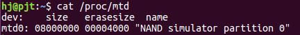
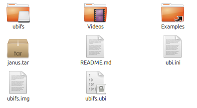
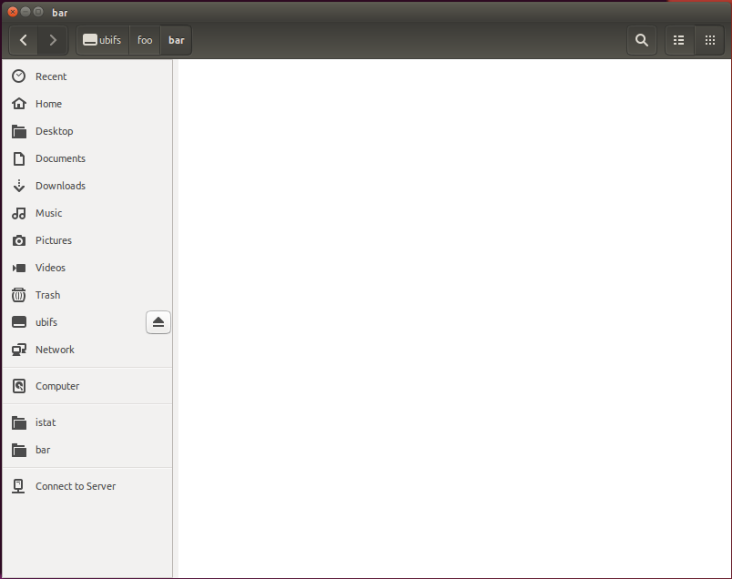

1. 관련 apt 설치
```sudo apt install mtd-utils```

2. 홈 디렉토리에 ubifs 디렉토리 생성
```sudo mkdir ~/ubifs```

3. ubifs.img 이미지 생성
sudo /usr/sbin/mkfs.ubifs -m 2048 -e 129024 -c 677 -r ~/ubifs ubifs.img

4. ubi.ini 파일 생성 및 설정 변경.

```
1) touch ubi.ini
2) vim ubi.ini
```

```
[ubi_rfs]
mode=ubi
image=ubifs.img
vol_id=0
vol_size=87349248
vol_type=dynamic
vol_name=ubi_rfs
vol_alignment=1
vol_flags=autoresize
```

4. ubifs.ubi rootfs 이미지 생성.
sudo /usr/sbin/ubinize -o ubifs.ubi -p 131072 -m 2048 -s 512 -O 512 ubi.ini

5. nandsim 을 통한 UBI 이미지 마운트
```sudo modprobe nandsim first_id_byte = 0x20 second_id_byte = 0xaa third_id_byte = 0x00 fourth_id_byte = 0x15```

만약 이 단계에서 오류가 나온다면
```sudo modprobe nandsim``` 을 먼저 한 후 5를 다시 실행한다.

잘 되었는지 확인
```
cat /proc/mtd
```
아래 그림과 같이 mtd와 errsize 가 할당되어야 한다.


6. mtd 장치에 연결
```sudo modprobe ubi mtd = 0```

7. 포멧하기 전에 detach
```sudo ubidetach /dev/ubi_ctrl -m 0```

8. 포멧팅 시작
```sudo ubiformat /dev/mtd0 -f ubifs.ubi```

9. 붙이기
``` sudo ubiattach /dev/ubi_ctrl -m 0 ```

10. ubifs 에 마운트 !
```sudo mount -t ubifs ubi0 ubifs/```

이미지가 마운트 된 것을 확인한다!




