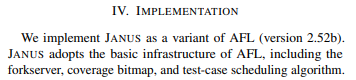
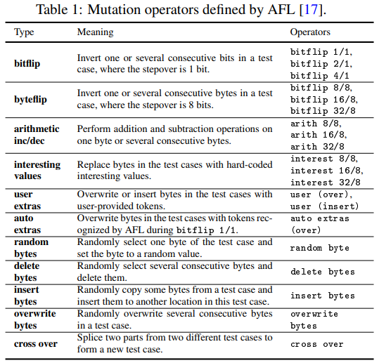
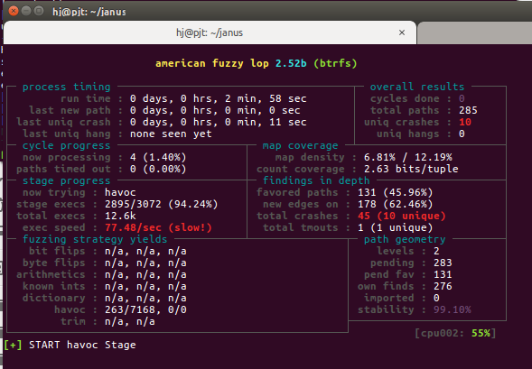

JANUS 는 forkserver, coverage bitmap, test-case scheduling algorithm 을 포함한 기본 구조가 AFL과 동일하다고 한다.




그렇다면 AFL을 확인하고 AFL과 바뀐 부분을 중점적으로 살펴보자.
다음은 AFL의 mutation 연산자들이다.



다음은 AFL의 mutation 스케쥴링 구조이다.


상단의 그림을 보면 

1. deterministic stage, Havoc stage, Splicing stage 3개의 stage가 있다. 
JANUS는 deterministic stage, Splicing stage를 모두 생략하고 바로 Havoc stage를 사용한다.


이제 변경된 부분을 보자.
다음은 JANUS에서 추가한 헤더파일이다.
```C
#include <sys/sendfile.h>
#include <mutator_wrapper.hpp>
```

```C
int main(int argc, char** argv) {
```

JANUS에서 추가된 옵션
```C
      case 'u': /* CPU# */
	        if (sscanf(optarg, "%u", &cpu_id) != 1)
	          PFATAL("Invalid CPU#");

	  case 'g': /* image path */
		image_file = optarg;
	        OKF("[fs-fuzz] target image path: %s", image_file);

	
      case 'k': /* kernel fuzz mode */
		OKF("We are now fuzzing kernel");
	 
	  case 'b': /* shm name */
		shm_name = optarg;
		fsfuzz_mode = 1;
	        OKF("[fs-fuzz] shm name to store image buffer: %s", shm_name);

	  
	  case 's': /* wrapper.so path */
		wrapper_file = optarg;
		fsfuzz_mode = 1;
	        OKF("[fs-fuzz] target wrapper (.so) path: %s", wrapper_file);
	  
	  case 'e': /* seed */
		seed_file = optarg;
		fsfuzz_mode = 1;
	        OKF("[fs-fuzz] seed image path: %s", seed_file);

	  case 'y' : /* syscall input dir */
		syscall_in_dir = optarg;
		fsfuzz_mode = 1;
	        OKF("[fs-fuzz] syscall input directory: %s", syscall_in_dir);


```
JANUS 에서 추가한 함수
```C
setup_wrapper()
write_execs_file()
load_seed_image()
load_syscalls()

```
JANUS 에서 추가한 변수
```C
static u32 cpu_id = -1;
static u32 fsfuzz_mode = 0;
static u32 meta_size = 0;
u32 fsfuzz_queued;
u32 _step = 1;
EXP_ST u8 *image_file,	  		/* for fs fuzzing					  */
	  *wrapper_file,	  	/* for fs fuzzing					  */
	  *seed_file,	  		/* for fs fuzzing 					  */
	  *syscall_in_dir,         	/* for fs fuzzing					  */
	  *shm_name;	 		/* for fs fuzzing					  */

u32 orig_queued_with_cov; // 
```

1) JANUS에선 Trimming을 하지 않는다.

```C
  /************
   * TRIMMING *
   ************/

   // fs-fuzz: we cannot arbitrary trim for now...

  if (!fsfuzz_mode && !dumb_mode && !queue_cur->trim_done) {


```

fuzz_one 스케쥴링 확인!!

```C
static u8 fuzz_one(char** argv) {

  s32 len, fd, temp_len, i, j;
  u8  *in_buf, *out_buf, *orig_in, *ex_tmp, *eff_map = 0;
  u64 havoc_queued,  orig_hit_cnt, new_hit_cnt;
  u32 splice_cycle = 0, perf_score = 100, orig_perf, prev_cksum, eff_cnt = 1;
  u32 orig_queued_with_cov;

  u8  ret_val = 1, doing_det = 0;

  u8  a_collect[MAX_AUTO_EXTRA];
  u32 a_len = 0;

  if (queue_cur->depth > 1) return 1;

  if (pending_favored) {

    /* If we have any favored, non-fuzzed new arrivals in the queue,
       possibly skip to them at the expense of already-fuzzed or non-favored
       cases. */

    if ((queue_cur->was_fuzzed || !queue_cur->favored) &&
        UR(100) < SKIP_TO_NEW_PROB) return 1;

  } else if (!dumb_mode && !queue_cur->favored && queued_paths > 10) {

    /* Otherwise, still possibly skip non-favored cases, albeit less often.
       The odds of skipping stuff are higher for already-fuzzed inputs and
       lower for never-fuzzed entries. */

    if (queue_cycle > 1 && !queue_cur->was_fuzzed) {

      if (UR(100) < SKIP_NFAV_NEW_PROB) return 1;

    } else {

      if (UR(100) < SKIP_NFAV_OLD_PROB) return 1;

    }

  }

  if (not_on_tty) {
    ACTF("Fuzzing test case #%u (%u total, %llu uniq crashes found)...",
         current_entry, queued_paths, unique_crashes);
    fflush(stdout);
  }

  /* 테스트 케이스를 메모리에 매핑. */
  fd = open(queue_cur->fname, O_RDONLY);
  len = queue_cur->len;
  orig_in = in_buf = mmap(0, len, PROT_READ | PROT_WRITE, MAP_PRIVATE, fd, 0);
  close(fd);

  out_buf = ck_alloc_nozero(len);
  subseq_tmouts = 0;
  cur_depth = queue_cur->depth;

  if (queue_cur->cal_failed) {
    if (queue_cur->cal_failed < CAL_CHANCES) {  
    	CALIBRATION 수행
    }
  }

  memcpy(out_buf, in_buf, len);

  /* 스코어 계산. */
  orig_perf = perf_score = calculate_score(queue_cur);

```
스코어 계산 이후 deterministic stage 가 있다.
JANUS는 splicing stage도 skip 한다.
하지만 JANUS는 바로! havoc_stage로 가라고 한다!

```C
  if (fsfuzz_mode || skip_deterministic || queue_cur->was_fuzzed || queue_cur->passed_det)
    goto havoc_stage;

```

스코어 계산이 끝나고 

havoc 스테이지 !!
```C

havoc_stage:

  stage_cur_byte = -1;

  if (!splice_cycle) {	//splice 

    stage_name  = "havoc";
    stage_short = "havoc";
    stage_max   = (doing_det ? HAVOC_CYCLES_INIT : HAVOC_CYCLES) *
		 perf_score / havoc_div / 100;

  } else {

    static u8 tmp[32];
    perf_score = orig_perf;
    sprintf(tmp, "splice %u", splice_cycle);
    stage_name  = tmp;
    stage_short = "splice";
    stage_max   = SPLICE_HAVOC * perf_score / havoc_div / 100;

  }

  if (stage_max < HAVOC_MIN) stage_max = HAVOC_MIN; //stage_max = 16

  temp_len = fsfuzz_mode ? meta_size : len;

  orig_hit_cnt = queued_paths + unique_crashes;

  orig_queued_with_cov = queued_with_cov;

  havoc_queued = queued_paths;

```

cov
```C

  //랜덤으로 수천개를 꼬아보고 비틀어 본다.
  for (stage_cur = 0; stage_cur < stage_max; stage_cur++) {

    u32 use_stacking = 1 << (1 + UR(HAVOC_STACK_POW2)); // UR() - 1 을 난수만큼 왼쪽으로 shift 연산
    stage_cur_val = use_stacking;

    for (i = 0; i < use_stacking; i++) { // 1-128 번 비트를 꼬거나 바꾼다.

      // switch (UR(15 + ((extras_cnt + a_extras_cnt) ? 2 : 0))) { // AFL은 16개의 case 활용
      switch (UR(12 + ((extras_cnt + a_extras_cnt) ? 1 : 0))) {    // JANUS는 12개의 case 활용

        case 0: /* 랜덤으로 1 bit 비트플립*/ FLIP_BIT(out_buf, UR(temp_len << 3)); 
        case 1: /* 오버플로우 혹은 음수 등의 값을 넣어본다. */ out_buf[UR(temp_len)] = interesting_8[UR(sizeof(interesting_8))]; 
        case 2: /* 상동(16비트) */
        case 3: /* 상동(32비트) */
        case 4: /* 랜덤 바이트를 빼보기 */ out_buf[UR(temp_len)] -= 1 + UR(ARITH_MAX);
        case 5: /* 랜덤 바이트를 더하기 */ out_buf[UR(temp_len)] += 1 + UR(ARITH_MAX); 
        case 6: /* 랜덤으로 워드를 빼기(16비트) (endian -랜덤) */ 
        case 7: /* 랜덤으로 워드를 더하기(16비트) (endian -랜덤) */ 
        case 8: /* 랜덤으로 더블 워드를 빼기(16비트) (endian -랜덤) */ 
        case 9: /* 랜덤으로 워드를 더하기(16비트) (endian -랜덤) */ 
        case 10:/* 랜덤으로 바이트를 랜덤 값으로 바꿔보기
        case 11:/* Overwrite bytes with a randomly selected chunk (75%) or fixed bytes (25%). */
        case 12:/* Overwrite bytes with an extra. */
    }

```

for문을 돌고 난 후 common_fuzz_stuff 함수에 비틀어 놓은 인자(out_buf) 를 집어 넣어서 버릴 지 말지 확인.

```C

    if (common_fuzz_stuff(argv, out_buf, len))		// 수정된 테스트 case를 실행해보고 queue에 추가 할지 말지 결정.
      goto abandon_entry;

    memcpy(out_buf, in_buf, temp_len); 			// 버리지 않는다면 out_buf 를 in_buf에 복사.(feed-back)

    if (queued_paths != havoc_queued) {			

      if (perf_score <= HAVOC_MAX_MULT * 100) {
        stage_max  *= 2;
        perf_score *= 2;
      }

      havoc_queued = queued_paths;

    }
  }

  new_hit_cnt = queued_paths + unique_crashes;

  if (!splice_cycle) {
    stage_finds[STAGE_HAVOC]  += new_hit_cnt - orig_hit_cnt;
    stage_cycles[STAGE_HAVOC] += stage_max;
  } else {
    stage_finds[STAGE_SPLICE]  += new_hit_cnt - orig_hit_cnt;
    stage_cycles[STAGE_SPLICE] += stage_max;
  }

  if (queued_with_cov > orig_queued_with_cov)  // bit 커버리지가 늘었으면 
    goto ret;
  else
    goto fsfuzz_stage;

```
이 단계에서 crash도 많이 나온다.
하단의 이미지를 보면 havoc stage 인 상태의 Crash를 확인할 수 있다.




드디어 추가된 fsfuzz_stage 시작!!!
```C

fsfuzz_stage:

  mutate_havoc_init(out_buf + meta_size, len - meta_size, stage_max); // havoc을 위한 Class를 초기화.

  u8* new_buf = (u8*)ck_alloc(meta_size + MAX_FILE);

  memcpy(new_buf, out_buf, len); // new_buf 를 할당 후 out_buf

  for(stage_cur = 0; stage_cur < stage_max; stage_cur++) { 

      fs_buf_len = mutate_havoc(new_buf + meta_size, MAX_FILE, MUTATE); // havoc 클래스에를 만듬. 외부 Mutator 를 호출하여 mutate를 실행하는데 Random Systemcall 을 변형한 후 program을 return .

      if (common_fuzz_stuff(argv, new_buf, meta_size + fs_buf_len)) goto abandon_entry; // syscall을 변형한 이미지를 넣고 버릴지 말지 확인.

      if (queued_paths != fsfuzz_queued) {

        if (perf_score <= HAVOC_MAX_MULT * 100) {
            stage_max  *= 2;
            perf_score *= 2;
        }

        fsfuzz_queued = queued_paths;

     }

  }

  if (queued_paths > init_queued)
      goto fsfuzz_fini;


```

