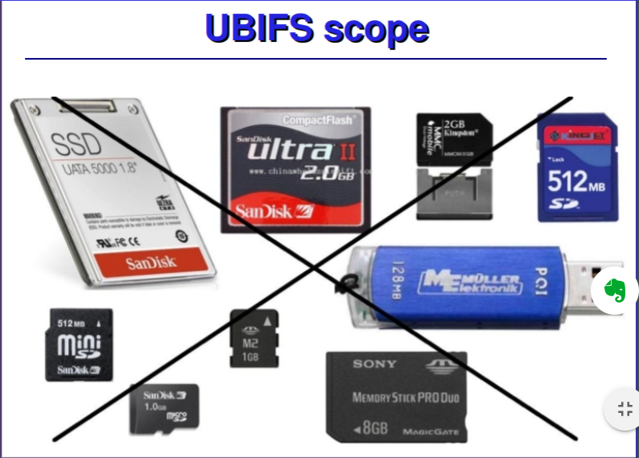
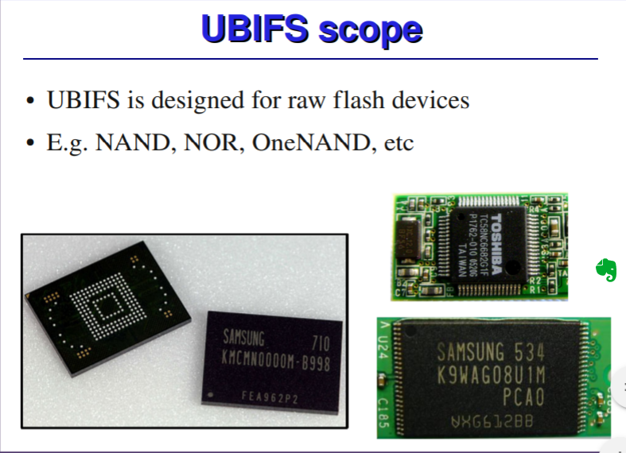
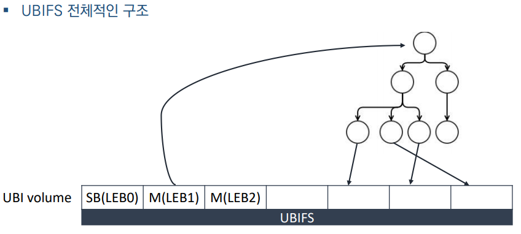
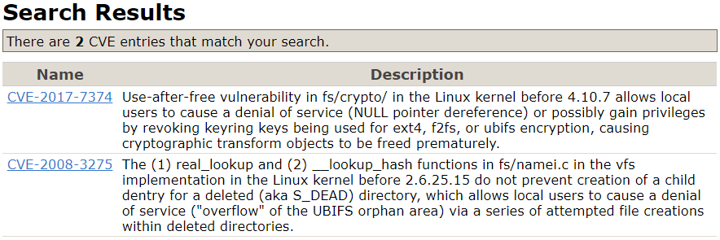

하다보니 UBIFS의 metaData와 블럭구조에 대해 알아야 할 필요가 느껴졌다...

<특징>
1. raw flash device 용도




-> 임베디드 리눅스 장비에서 램 디스크를 이용하여 루트 파일시스템을 구현 하였을 경우, 전원이 꺼짐과 동시에 내용이 소실된다. 따라서 기록된 내용을 영구 저장하기 위해 플래시 메모리에 기록할 필요가 생긴다고 한다. 따라서 플래시 메모리를 리눅스의 루트 파일 시스템으로 사용하기 위해 MTD(Memoery Technology Device) 블록 디바이스 드라이버를 사용한다.
---

<용어정리>
super block 노드 : 파일시스템 전체의 정보를 담고 있다.
Master Node : Root index 노드의 LEB Number를 알고있음
ino_node : 파일에 대한 메타데이터 정보가 있다.
dent_node : 파일 이름에 대한 정보가 있다.
Common header : 모든 노드들의 공통 헤더(슈퍼 블록 노드도 가지고 있음)
PEB : 물리 erase 블럭
LEB : 논리 erase 블럭

---

<UBIFS 정리>

출처 : http://www.linux-mtd.infradead.org/doc/ubifs.pdf

---

1. UBIFS 의 전체구조
SB(superblock) / M(Master node) / LEB (Logical Erase Block)


위 그림에서 보면 LEB1 이 가리키는 트리는 ino_node 트리로, Root index 노드를 가리키고 있고 하위에 있는 노드들은

신기한 건 CVE가 2개밖에 나오지 않았다.. 비주류라 사용이 안되는 것일 수도 있다..


---

따라서 그림에 따라 해야 할 일
1. LEB0의 super block parsing - 0x18 부터 시작(+4096)
2. LEB1의 Master node parsing
3. LEB2의 Master node parsing
4. LEB1의


```C

struct ubifs_sb_node {
	struct ubifs_ch ch; // ubifs의 공통 헤더 (24바이트)
	__u8 padding[2];
	__u8 key_hash;
	__u8 key_fmt;
	__le32 flags;
	__le32 min_io_size;
	__le32 leb_size;
	__le32 leb_cnt;
	__le32 max_leb_cnt;
	__le64 max_bud_bytes;
	__le32 log_lebs;
	__le32 lpt_lebs;
	__le32 orph_lebs;
	__le32 jhead_cnt;
	__le32 fanout;
	__le32 lsave_cnt;
	__le32 fmt_version;
	__le16 default_compr;
	__u8 padding1[2];
	__le32 rp_uid;
	__le32 rp_gid;
	__le64 rp_size;
	__le32 time_gran;
	__u8 uuid[16];
	__le32 ro_compat_version;
	__u8 padding2[3968];
} __packed;

```

UBIFS 의 메타데이터 정보를 담고있는 노드.
```C
struct ubifs_ino_node {
	struct ubifs_ch ch;
	__u8 key[UBIFS_MAX_KEY_LEN];
	__le64 creat_sqnum;
	__le64 size;
	__le64 atime_sec;
	__le64 ctime_sec;
	__le64 mtime_sec;
	__le32 atime_nsec;
	__le32 ctime_nsec;
	__le32 mtime_nsec;
	__le32 nlink;
	__le32 uid;
	__le32 gid;
	__le32 mode;
	__le32 flags;
	__le32 data_len;
	__le32 xattr_cnt;
	__le32 xattr_size;
	__u8 padding1[4]; /* Watch 'zero_ino_node_unused()' if changing! */
	__le32 xattr_names;
	__le16 compr_type;
	__u8 padding2[26]; /* Watch 'zero_ino_node_unused()' if changing! */
	__u8 data[];
} __packed;
```
