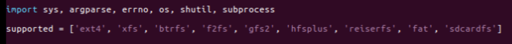
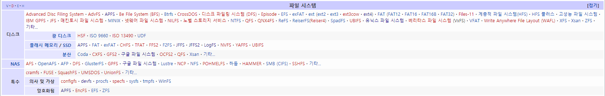

목차
1. 파일시스템 선정
2. 파일시스템

1. 파일시스템 선정

파일시스템을 추가하기 위해 hydra, janus가 어떤 파일시스템을 지원하는지 알아보자.



<ext4, xfs, btrfs, f2fs, gfs2, hfsplus, reiserfs, fat, sdcardfs> 총 9가지를 제공한다.

파일시스템의 종류를 알아보기 위해 나무위키에 검색해 보니 아래 그림과 같이 나왔다.


선정 조건
1) JANUS/Hydra에서 하지 않았던 FS
2) LKL에서 지원 가능한지?
3) 우리가 예상한 시나리오가 가능한지?
4) 얼마나 파급력이 있는지?
5) 관련 정보를 찾을 수 있는지?

후보제외군
1) EFS(AWS Elastic File System) 클라우드 용
2) APFS(Apple FileSystem) LKL에 없음
3) ntfs linux (window 용)
4) adfs (window server용 )
5) befs(Be FS) - BeOS 를 위한 filesystem.
6) exofs - 버전 5.1-rc1에서 제거됨

후보군
1) ubifs (Unsorted Block Image File System) - 관리되지 않는 플래시 메모리 장치를 위한 플래시 파일 시스템으로 임베디드 장비에서 많이 사용하는 것 같다.
2) jffs2 (journel FileSystem 2) -  플래시 메모리 장치에 쓰이는 리눅스 로그 구조 파일 시스템이다. ubifs 가 더 나중에 나온 상위버전이므로 ubifs로 가야겠다..

---

UBIFS 를 추가하기로 했다.

소스 수정 시작.
<lkl/compile>
```C
supported = ['ext4', 'xfs', 'btrfs', 'f2fs', 'gfs2', 'hfsplus', 'reiserfs', 'fat', 'squashfs','ubifs']

```
