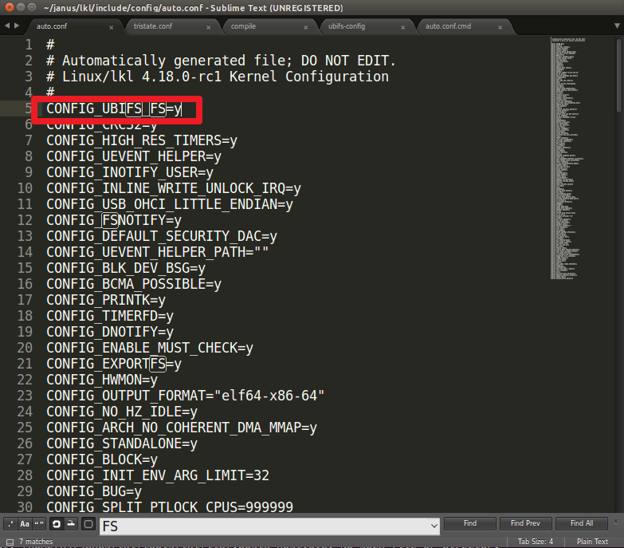
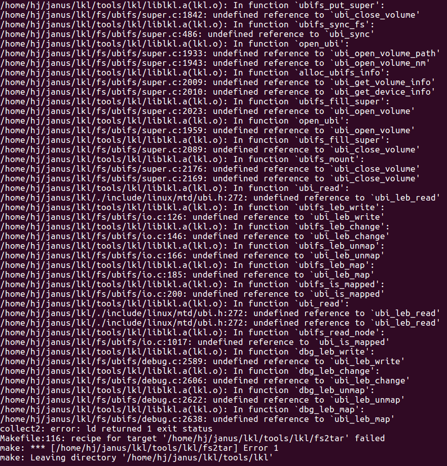

LKL에 다른 모듈을 추가해서 컴파일 하는 게 이렇게 오래걸리는 줄은 몰랐다...;;

LKL이 다른 모듈 추가할 때 보는 파일 : lkl/arch/lkl/defconfig

janus는 이 defconfig파일을 수정한다 : janus/lkl/[module]-config

* 자신의 모듈이 들어가지 않는다면 lkl/script/kconfig 폴더에 config 데이터를 파싱하는 로직에서
유효성검사(나의 모듈(UBIFS)이 필요로 하는 다른 모듈(MTD)이 빠짐...)에 걸려버린 거시어따... -> 미끼를 물어분 것이어~
이로 인해 나의 모듈 설정이 빠지고 컴파일 되어버렸다.. (거의 2주간 찾아 헤맸다;)

상세함수

```
janus/lkl/script/kconfig/confdata.c 의 int conf_read(const char *name) 함수
``` 

커널 소스는 너무 방대하므로 유효성 검사를 제대로 적용해 주기가 더 힘들다.(사전에 오류가 날 것을 알고 미리 걸러버림..ㅠ)
따라서 나의 모듈을 1개를 강제로 들어가게 한 뒤 그 모듈로 인한 오류를 확인해보자. (모듈 추가했을 때 사후 오류를 보고 고치는 방안)

1. 컴파일 속도 늦추기 (-j 옵션 빼기)
subprocess.call('make -C tools/lkl CC="%s/../ff-gcc/ff-gcc fs/%s"' % (dir_path, args.type), shell=True)

2. 컴파일 실행 후 janus/lkl/include/config/auto.conf 파일 에 자신의 모듈 심볼을 계속 추가하기!
* 이 파일은 defconfig 파일을 읽어서 파싱한 결과(나의 모듈을 빼고)가 저장되므로 컴파일 시 나의 모듈을 계속 추가해주자.



3. 2번을 실행하면 자신의 모듈은 컴파일이 되고 여러가지 오류가 나올 수 있다. 그 오류를 하나씩 해결하다 보면 어떤 모듈이 빠져있는지 알 수 있다.


