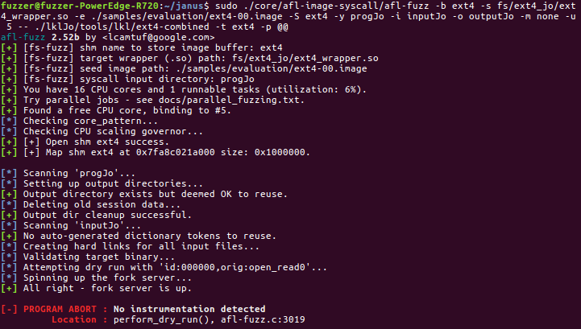
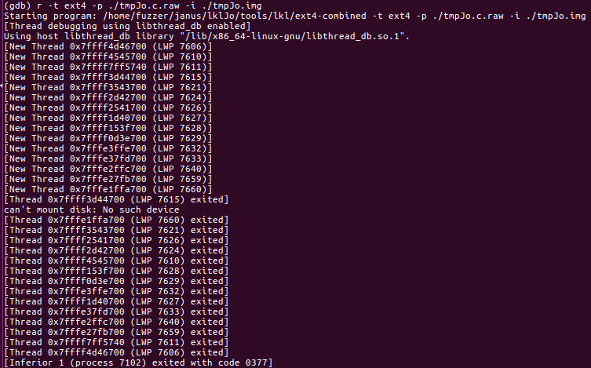
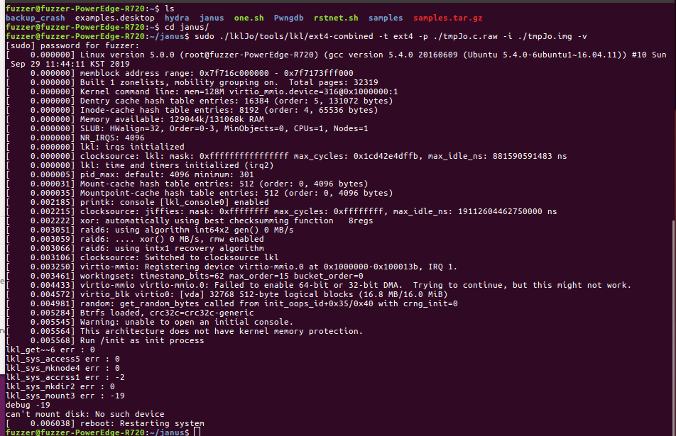
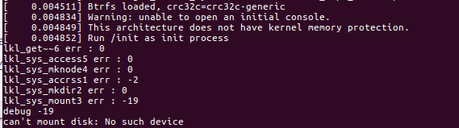

LKL 5.0 버전으로 올린 후 ext4를 실행해 보니 다음과 같이 에러가 나왔다.



원인은 ```No Instrumentation detected``` 이었는데 이는 타겟 파일인 ./lkl/tools/lkl/ext4-combined 이 제대로 작동이 안되는 것 때문이다. 
오류 원인을 좀 더 들어가보니 lkl_mount_dev 시 마운트가 안 되는 것 같다. gdb로 실행시켜 자세하게 보니 thread가 주르륵 실행되고 중간에 마운트가 안되는 상황이 발생했다.




하다하다 방법이 안 나와서 지효에게 물어보니 v옵션과 error 로그를 찍어놓고 실행하기로 했다..


```C
long lkl_mount_dev(unsigned int disk_id, unsigned int part,
                   const char *fs_type, int flags,
                   const char *data, char *mnt_str, unsigned int mnt_str_len)
{
        char dev_str[] = { "/dev/xxxxxxxx" };
        unsigned int dev;
        int err;
        char _data[4096]; /* FIXME: PAGE_SIZE is not exported by LKL */

        if (mnt_str_len < sizeof(dev_str))
                return -LKL_ENOMEM;

        err = lkl_get_virtio_blkdev(disk_id, part, &dev);

	/*err Log*/
        printf("lkl_get~~6 err : %d\n", err);
	/*err Log*/

        if (err < 0)
                return err;

        snprintf(dev_str, sizeof(dev_str), "/dev/%08x", dev);
        snprintf(mnt_str, mnt_str_len, "/mnt/%08x", dev);

        err = lkl_sys_access("/dev", LKL_S_IRWXO);

	/*err Log*/
        printf("lkl_sys_access5 err : %d\n", err);
	/*err Log*/

        if (err < 0) {
                if (err == -LKL_ENOENT)
                        err = lkl_sys_mkdir("/dev", 0700);
                if (err < 0)
                        return err;
        }

```

```C
        err = lkl_sys_mknod(dev_str, LKL_S_IFBLK | 0600, dev);

	/*err Log*/
        printf("lkl_sys_mknode4 err : %d\n", err);
	/*err Log*/

        if (err < 0)
                return err;

        err = lkl_sys_access("/mnt", LKL_S_IRWXO);

	/*err Log*/
        printf("lkl_sys_accrss1 err : %d\n", err);
	/*err Log*/

        if (err < 0) {
                if (err == -LKL_ENOENT)
                        err = lkl_sys_mkdir("/mnt", 0700);
                if (err < 0)
                        return err;
        }

```


```C
        err = lkl_sys_mkdir(mnt_str, 0700);

	/*err Log*/
        printf("lkl_sys_mkdir2 err : %d\n", err);
	/*err Log*/

        if (err < 0) {
                lkl_sys_unlink(dev_str);
                return err;
        }

```


```C
        /* kernel always copies a full page */
        if (data) {
                strncpy(_data, data, sizeof(_data));
                _data[sizeof(_data) - 1] = 0;
        } else {
                _data[0] = 0;
        }
	
        err = lkl_sys_mount(dev_str, mnt_str, (char *)fs_type, flags, _data);

	/*err Log*/
        printf("lkl_sys_mount3 err : %d\n", err);
	/*err Log*/

        if (err < 0) {
                lkl_sys_unlink(dev_str);
                lkl_sys_rmdir(mnt_str);
                return err;
        }

        return 0;


```

타겟파일만 실행해보기 위해 에러로그 + -v 옵션을 주고 이미지와 program을 실행하자 아래와 같은 에러가 나왔다.




중점적으로 봐야 할 것은 lkl을 5.0으로 포팅하면서 어떤 부분이 바뀌었는지는 모르겠지만 btrfs로 읽어오는게 문제인 거 같다. 어느 부분을 봐야 하는지는 모르겠지만 여기저기 삽질을 해봐야 할 거 같다..




