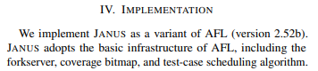
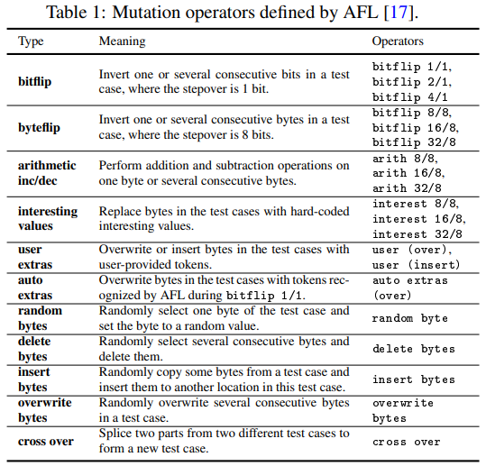
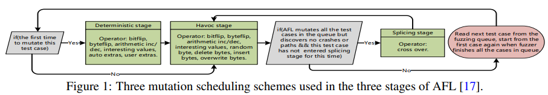
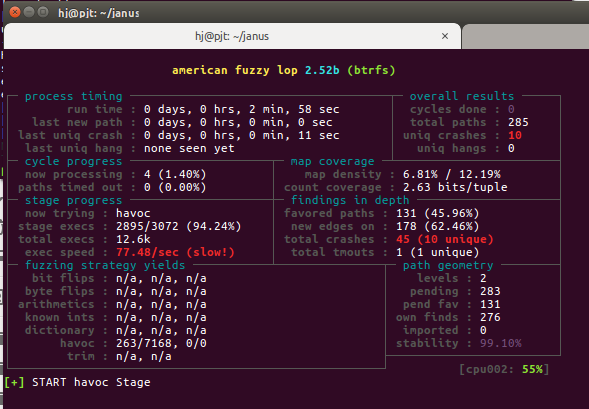

JANUS 는 forkserver, coverage bitmap, test-case scheduling algorithm 을 포함한 기본 구조가 AFL과 동일하다고 한다.




그렇다면 AFL을 확인하고 AFL과 바뀐 부분을 중점적으로 살펴보자.
다음은 AFL의 mutation 연산자들이다.



다음은 AFL의 mutation 스케쥴링 구조이다.


상단의 그림을 보면 

1. deterministic stage, Havoc stage, Splicing stage 3개의 stage가 있다. 
JANUS는 deterministic stage, Splicing stage를 모두 생략하고 바로 Havoc stage를 사용한다.


이제 변경된 부분을 보자.
다음은 JANUS에서 추가한 헤더파일이다.
```C
#include <sys/sendfile.h>
#include <mutator_wrapper.hpp>
```

```C
int main(int argc, char** argv) {
```

JANUS에서 추가된 옵션
```C
	case 'u': /* CPU# */
	case 'g': /* image path */
	case 'k': /* kernel fuzz mode */
	case 'b': /* shm name */
	case 's': /* wrapper.so path */
	case 'e': /* seed */
	case 'y' : /* syscall input dir */
```


JANUS 에서 추가한 함수

```C
setup_wrapper()
write_execs_file()
load_seed_image()
load_syscalls()
```
JANUS 에서 추가한 변수

```C
static u32 cpu_id = -1;
static u32 fsfuzz_mode = 0;
static u32 meta_size = 0;
u32 fsfuzz_queued;
u32 _step = 1;

EXP_ST u8 *image_file,	  		/* for fs fuzzing					  */
	  *wrapper_file,	  	/* for fs fuzzing					  */
	  *seed_file,	  		/* for fs fuzzing 					  */
	  *syscall_in_dir,         	/* for fs fuzzing					  */
	  *shm_name;	 		/* for fs fuzzing					  */

u32 orig_queued_with_cov; // 
```

1) JANUS에선 Trimming을 하지 않는다.

```C
  /************
   * TRIMMING *
   ************/

   // fs-fuzz: we cannot arbitrary trim for now...

  if (!fsfuzz_mode && !dumb_mode && !queue_cur->trim_done) {
```


-----------------전체적인 afl-fuzz.c 의 동작방식---------------------
1. 첫 실행 시 옵션체크
2. wrapper, cpu, shm, 등 세팅
3. seed image 로드
4. syscall 로드
5. while 문으로 무한반복
5-1. queue 1개를 추출
5-2. fuzz_one() 으로 퍼징 후 output 디렉토리에 test_case 를 write 함. 이때 crash 발생 한 경우 output/crash 파일 write 함. 
5-3. sync_fuzzers() 에서 다른 코어별 퍼저들의 싱크를 맞춘다. 이때 A 퍼저에서 coverage가 늘었거나 crash가 났으면 B 퍼저에도 sync를 맞추고 알려준다. 모두 동기화!! 
--------------------------------------------------------------------


fuzz_one() 에서 스케쥴링 확인을 해보자.

```C
static u8 fuzz_one(char** argv) {

  u64 havoc_queued, new_hit_cnt;
  u32 orig_queued_with_cov;

  /* 테스트 케이스(queue) 를 메모리에 매핑. */
  fd = open(queue_cur->fname, O_RDONLY);

  len = queue_cur->len;
  orig_in = in_buf = mmap(0, len, PROT_READ | PROT_WRITE, MAP_PRIVATE, fd, 0);
  close(fd);

  out_buf = ck_alloc_nozero(len);
  subseq_tmouts = 0;
  cur_depth = queue_cur->depth;


  memcpy(out_buf, in_buf, len);

  out_buf = ck_alloc_nozero(len);

  /* 현재 queue의 퍼포먼스 스코어 계산. */
  orig_perf = perf_score = calculate_score(queue_cur);
```


스코어 계산 이후 deterministic stage 가 있다.
JANUS는 splicing stage도 skip 한다.
하지만 JANUS는 바로! havoc_stage로 가라고 한다!


```C
  if (fsfuzz_mode || skip_deterministic || queue_cur->was_fuzzed || queue_cur->passed_det)
    goto havoc_stage;
```

스코어 계산이 끝나고 

havoc 스테이지 !!
```C

havoc_stage:

  if (!splice_cycle) {	//splice 

    stage_name  = "havoc";
    stage_short = "havoc";

  } else {

    perf_score = orig_perf;
    stage_name  = tmp;
    stage_short = "splice";

  }

  if (stage_max < HAVOC_MIN) stage_max = HAVOC_MIN; //stage_max = 16

  temp_len = fsfuzz_mode ? meta_size : len;

  orig_hit_cnt = queued_paths + unique_crashes;

  orig_queued_with_cov = queued_with_cov;

  havoc_queued = queued_paths;

```

JANUS 가 사용하는 havoc stage에서의 case 12가지.
```C

  //랜덤으로 수천개를 꼬아보고 비틀어 본다.
  for (stage_cur = 0; stage_cur < stage_max; stage_cur++) {

    u32 use_stacking = 1 << (1 + UR(HAVOC_STACK_POW2)); // UR() - 1 을 난수만큼 왼쪽으로 shift 연산
    stage_cur_val = use_stacking;

    for (i = 0; i < use_stacking; i++) { // 2-128 번 비트를 꼬거나 바꾼다.(2,4,8,16,32,64,128)

      // switch (UR(15 + ((extras_cnt + a_extras_cnt) ? 2 : 0))) { // AFL은 16개의 case 활용
      switch (UR(12 + ((extras_cnt + a_extras_cnt) ? 1 : 0))) {    // JANUS는 12개의 case 활용

        case 0: /* 랜덤으로 1 bit 비트플립*/ FLIP_BIT(out_buf, UR(temp_len << 3)); 
        case 1: /* 오버플로우 혹은 음수 등의 값을 넣어본다. */ out_buf[UR(temp_len)] = interesting_8[UR(sizeof(interesting_8))]; 
        case 2: /* 상동(16비트) */
        case 3: /* 상동(32비트) */
        case 4: /* 랜덤 바이트를 빼보기 */ out_buf[UR(temp_len)] -= 1 + UR(ARITH_MAX);
        case 5: /* 랜덤 바이트를 더하기 */ out_buf[UR(temp_len)] += 1 + UR(ARITH_MAX); 
        case 6: /* 랜덤으로 워드를 빼기(16비트) (endian -랜덤) */ 
        case 7: /* 랜덤으로 워드를 더하기(16비트) (endian -랜덤) */ 
        case 8: /* 랜덤으로 더블 워드를 빼기(16비트) (endian -랜덤) */ 
        case 9: /* 랜덤으로 워드를 더하기(16비트) (endian -랜덤) */ 
        case 10:/* 랜덤으로 바이트를 랜덤 값으로 바꿔보기
        case 11:/* Overwrite bytes with a randomly selected chunk (75%) or fixed bytes (25%). */
        case 12:/* Overwrite bytes with an extra. */
    }

```

이를 output/btrfs/queue 파일과 같이 보면, 

초기 quueue -> id:000007,orig:open_read 1~8

시작 queue ->  id:000009,src:000000,op:havoc,rep:128,+cov (src:현재 queue의 ID / op : stage / rep: havoc에 사용된 값, coverage가 증가한 queue)

중간 queue ->  id:000917,src:000238,op:fs-havoc-generate,rep:64

for문을 돌고 난 후 common_fuzz_stuff 함수에 비틀어 놓은 인자(out_buf) 를 집어 넣어서 버릴 지 말지 확인.

```C

    if (common_fuzz_stuff(argv, out_buf, len))		// 수정된 테스트 case를 실행해보고 queue에 추가 할지 말지 결정.
      goto abandon_entry;

    memcpy(out_buf, in_buf, temp_len); 			// 버리지 않는다면 out_buf 를 in_buf에 복사.(feed-back)

    if (queued_paths != havoc_queued) {			

      if (perf_score <= HAVOC_MAX_MULT * 100) {
        stage_max  *= 2;
        perf_score *= 2;
      }

      havoc_queued = queued_paths;

    }
  }

  new_hit_cnt = queued_paths + unique_crashes;
```

bit 커버리지가 늘었으면 종료 아니면 fuzzing 단계로.

```C
  if (queued_with_cov > orig_queued_with_cov)  
    goto ret; 
  else
    goto fsfuzz_stage; 
```


위의 스테이지 : havoc 단계에서도 crash도 많이 나온다.
하단의 이미지를 보면 havoc stage 인 상태의 Crash를 확인할 수 있다.




드디어 추가된 fsfuzz_stage 시작!!! (스테이지 : fs-havoc-mutate)
1. havoc class 초기화
2. 외부 Mutator 호출하여 mutate 실행한 뒤 Random으로 Syscall 변형.
3. common_fuzz_stuff()실행 - 타겟을 실행하여 일반적인 퍼징결과물인지 crash 인지 판별.


```C
fsfuzz_stage:

  mutate_havoc_init(out_buf + meta_size, len - meta_size, stage_max); // mutate 하기 위해 havoc class를 초기화.

  u8* new_buf = (u8*)ck_alloc(meta_size + MAX_FILE); // 버퍼 초기화.

  memcpy(new_buf, out_buf, len); // new_buf

  for(stage_cur = 0; stage_cur < stage_max; stage_cur++) { 

      fs_buf_len = mutate_havoc(new_buf + meta_size, MAX_FILE, MUTATE); // havoc 클래스에를 만듬. 외부 Mutator 를 호출하여 mutate를 실행하는데 무작위로 Systemcall 을 변형한 후 program을 return.

      if (common_fuzz_stuff(argv, new_buf, meta_size + fs_buf_len)) goto abandon_entry; // syscall을 변형한 이미지를 넣고 버릴지 말지 확인.

  }

  if (queued_paths > init_queued)
      goto fsfuzz_fini;
```


fsfuzz_stage -> common_fuzz_stuff 함수
설명 : target 을 실행하고 fault가 나는지 확인. - 결과를 fault X / 타임아웃 / 크래쉬 / 에러 / noinst / nobits 6가지의 경우로 정의했다.
      1) 타임아웃 or skip 요청 있을땐 - 해당 queue의 경로는 스킵
      2) 그 외 경우 save_if_interesting() 실행.

```C
common_fuzz_stuff(char** argv, u8* out_buf, u32 len) {

  write_to_testcase(out_buf, len); // 테스트를 위해 수정된 데이터를 파일에 write한다.

  fault = run_target(argv, exec_tmout);

  if (fault == FAULT_TMOUT || skip_requested) return 1;

  queued_discovered += save_if_interesting(argv, out_buf, len, fault);
  
  return 0;

}
```

