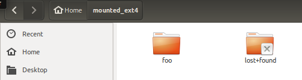
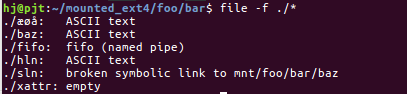
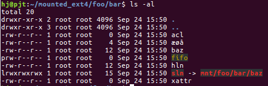
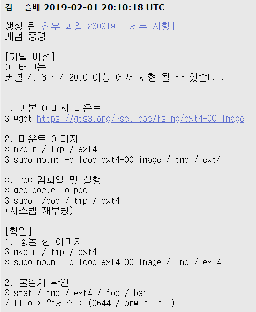
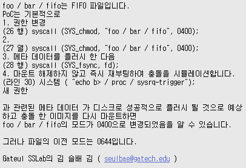
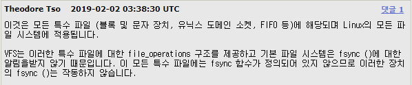
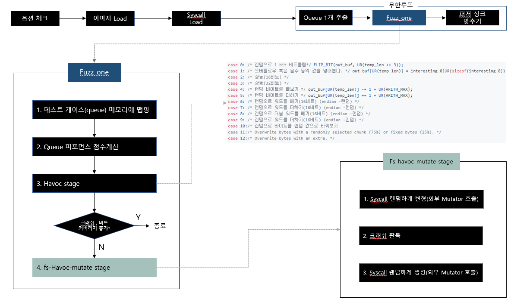

기존 JANUS에서 비틀어 볼 부분 확인.

1. 버전 업으로 인한 syscall 추가.
2. seed 이미지 변경?
3. 퍼저 스케쥴링 변경?
4. crash 판단기준?
5. trimming 하기?

1. 버전 업으로 인한 syscall 추가.
linux 4.17 -> 5.0으로 버전 올라가면서 추가된 syscall 함수.

추가된 syscall
```C
sys_io_pgetevents
sys_io_pgetevents_time32
sys_recvmmsg_time32
sys_rseq
ksys_personality

__ARCH_WANT_SYS_UTIME
```

삭제된 syscall
```C
sys_utimes
sys_futimesat
```

2. seed 이미지 변경?

우선 샘플 이미지에 어떤 것들이 있는지 확인해 보자. 

```

```
EXT4 부터 살펴보면, 하단의 이미지에서 lost+found는 ext4에서 기본적으로 손상되거나 알수없는 파일들의 정보가 보관되는 곳이라고 한다. 이건 파일시스템 별로 있을 수 있으므로 상관이 없을 것 같다.



그럼 foo 디렉토리를 살펴보자. 다음과 같이 6개의 파일들이 존재한다.



파일의 형식은 다음의 이미지에 있는 사진과 같다. 



여기서 추가하거나 바꿀 수 있는 부분이 있을까 생각해보며 자료를 찾다 보니 다음과 같은 자료가 나왔다.

https://bugzilla.kernel.org/show_bug.cgi?id=202485

다음의 링크를 들어가서 구글번역기로 좀 더 편하게 보면 




이에 대한 답변으로


다음과 같이 달렸다.

초기 seed이미지에 특수파일들을 넣는다면 crash가 나는 부분들도 기존 JANUS와는 다른 방식으로 나오지 않을까 생각하는데...ㅠ

3. 퍼저 스케쥴링 변경?

스케쥴링을 변경하는 부분은 지난주 자료에 있었던 다음의 이미지와 같다.


이 부분에서 우리가 뭘 바꿀 수 있을지 더 좋은 쪽으로 바꿀 수 있을지 의문이 든다..;;;


4. crash 판단기준?

```C
static u8 run_target(char** argv, u32 timeout) {

    ...

    s32 res;

  /* Report outcome to caller. */

  if (WIFSIGNALED(status) && !stop_soon) {

    kill_signal = WTERMSIG(status);

    if (child_timed_out && kill_signal == SIGKILL) return FAULT_TMOUT; 

    return FAULT_CRASH;

  }

  /* A somewhat nasty hack for MSAN, which doesn't support abort_on_error and
     must use a special exit code. */

  if (uses_asan && WEXITSTATUS(status) == MSAN_ERROR) {
    kill_signal = 0;
    return FAULT_CRASH;
  }

  if ((dumb_mode == 1 || no_forkserver) && tb4 == EXEC_FAIL_SIG)
    return FAULT_ERROR;

  return FAULT_NONE;

}
```


```C
static u8 save_if_interesting(char** argv, void* mem, u32 len, u8 fault) {
  switch (fault) {

    case FAULT_TMOUT:

      /* Timeouts are not very interesting, but we're still obliged to keep
         a handful of samples. We use the presence of new bits in the
         hang-specific bitmap as a signal of uniqueness. In "dumb" mode, we
         just keep everything. */

      total_tmouts++;

      if (unique_hangs >= KEEP_UNIQUE_HANG) return keeping;

      if (!dumb_mode) {
        if (!has_new_bits(virgin_tmout)) return keeping;
      }

      unique_tmouts++;

      /* Before saving, we make sure that it's a genuine hang by re-running
         the target with a more generous timeout (unless the default timeout
         is already generous). */

      if (exec_tmout < hang_tmout) {

        u8 new_fault;
        write_to_testcase(mem, len);
        new_fault = run_target(argv, hang_tmout);

        /* A corner case that one user reported bumping into: increasing the
           timeout actually uncovers a crash. Make sure we don't discard it if
           so. */

        if (!stop_soon && new_fault == FAULT_CRASH) goto keep_as_crash;
        if (stop_soon || new_fault != FAULT_TMOUT) return keeping;

      }

#ifndef SIMPLE_FILES
      fn = alloc_printf("%s/hangs/id:%06llu,%s", out_dir, unique_hangs, describe_op(0));
#else
      fn = alloc_printf("%s/hangs/id_%06llu", out_dir, unique_hangs);
#endif /* ^!SIMPLE_FILES */

      unique_hangs++;
      last_hang_time = get_cur_time();
      break;

    case FAULT_CRASH:

keep_as_crash:

      /* This is handled in a manner roughly similar to timeouts,
         except for slightly different limits and no need to re-run test
         cases. */

      total_crashes++;

      if (unique_crashes >= KEEP_UNIQUE_CRASH) return keeping;

      if (!dumb_mode) {

#ifdef __x86_64__
        simplify_trace((u64*)trace_bits);
#else
        simplify_trace((u32*)trace_bits);
#endif /* ^__x86_64__ */
        if (!has_new_bits(virgin_crash)) return keeping;
      }
      if (!unique_crashes) write_crash_readme();

#ifndef SIMPLE_FILES
      fn = alloc_printf("%s/crashes/id:%06llu,sig:%02u,%s", out_dir, unique_crashes, kill_signal, describe_op(0));
#else
      fn = alloc_printf("%s/crashes/id_%06llu_%02u", out_dir, unique_crashes, kill_signal);
#endif /* ^!SIMPLE_FILES */

      unique_crashes++;

      last_crash_time = get_cur_time();
      last_crash_execs = total_execs;

      break;

    case FAULT_ERROR: FATAL("Unable to execute target application");

    default: return keeping;

  }

  /* If we're here, we apparently want to save the crash or hang test case, too. */

  fd = open(fn, O_WRONLY | O_CREAT | O_EXCL, 0600);
  if (fd < 0) PFATAL("Unable to create '%s'", fn);
  ck_write(fd, mem, len, fn);
  close(fd);

  ck_free(fn);

  return keeping;

}
```
